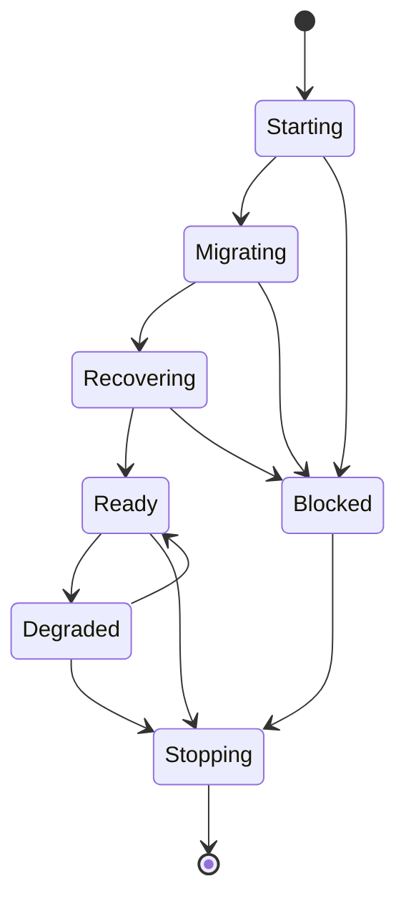

# Home Assistant App runtime and Ingress

- Status: Draft
- Date: 2026-09-20
- Catalog capability ID: `home-assistant-app-runtime`
- Owners: Symphonia maintainers
- Scope: define the install, lifecycle, authentication, persistence, recovery, upgrade, backup, and diagnostics contract for the primary Supervisor-managed App.
- Related requirements: `SYM-PROD-001`, `SYM-ACC-005`, `SYM-HA-001`–`SYM-HA-009`, `SYM-DEP-001`–`SYM-DEP-010`, `SYM-SEC-008`–`SYM-SEC-011`
- Related decisions/research: [ADR 0003](../docs/decisions/0003-home-assistant-app-primary.md), [ADR 0004](../docs/decisions/0004-home-assistant-native-ui.md), [system architecture](../docs/architecture/system-architecture.md), [Home Assistant platform research](../docs/providers/provider-research.md#home-assistant-platform), [UI foundation](home-assistant-native-ui.md)
- Required review gates: product UX, architecture, Home Assistant platform, testing, documentation, security/operations
- Open decisions blocking readiness: storage/recovery result from `RG-004`; supported Home Assistant versions and CPU architectures; encryption-key/backup contract; standalone release timing from `OQ-005`

## 1. Executive summary

Symphonia's primary artifact is a Supervisor-managed Home Assistant App whose administrative UI is available through authenticated Ingress. The App owns the long-running service, durable state, background operations, and provider adapters; Home Assistant is the deployment/authentication boundary, not the music domain.

The recommended runtime is one least-privileged, non-root App instance with durable `/data`, no host network or broad mounts, and no provider writes until migrations and recovery complete.

```text
Install App -> validate configuration -> migrate/recover durable state
-> become ready -> administrator opens Ingress UI -> operations run durably
-> backup/upgrade/restart -> recover before any new provider write
```

## 2. Problem, current behavior, and evidence

### 2.1 Problem

Without a runtime contract, framework selection can accidentally determine authentication, filesystem access, backup semantics, OAuth exposure, or job recovery. A service that appears usable through Ingress can still expose an unauthenticated direct port or resume provider writes before restored state is safe.

### 2.2 Current behavior

An owner-approved dependency-free runtime foundation exists, but the complete Supervisor-managed App described here does not. The foundation includes a non-root container metadata scaffold, `/data` persistence, validated process configuration, one shared Ingress path normalizer for configuration and HTTP routing, origin-form-only health/readiness/version routing, bounded response headers, composed SQLite stores with semantic readiness checks and connection cleanup on migration failure, transactionally consistent backup/preflight helpers with future-schema rejection, safe destination-path handling, and temporary-copy validation before publication, reverse-order cleanup after partial startup, retryable resource shutdown, and deterministic tests. It does not provide the accepted authentication, migration ledger, restore workflow, platform matrix, or complete lifecycle UI required by this SDD.

This SDD remains prospective and `Draft`; the foundation evidence below must not be read as implementation readiness or as proof that the complete App capability exists.

### 2.3 Foundation evidence boundary

The current foundation is intentionally limited to reversible composition, persistence, packaging, and safety contracts. It is useful for later spikes and does not resolve `RG-004`, the supported Home Assistant matrix, encryption-key/backup ownership, or standalone-release decisions. New App behavior must wait for those gates and explicit owner approval.

### 2.4 Evidence and unknowns

- Accepted evidence: [ADR 0003](../docs/decisions/0003-home-assistant-app-primary.md).
- Platform evidence: current App, Ingress, persistent `/data`, backup, and security documentation linked from [provider research](../docs/providers/provider-research.md#home-assistant-platform).
- Comparative evidence: Music Assistant uses a server/App plus separate HA integration; see the [ecosystem review](../docs/providers/home-assistant-ecosystem-review.md).
- Security evidence: a direct unauthenticated service port can bypass Ingress, as recorded in the ecosystem review.
- Unknowns: exact image/toolchain, supported architectures, encryption key source, online backup primitive, and first standalone release.

## 3. Actors, surfaces, and terminology

| Actor | Goal | Entry point | Visible surfaces |
| --- | --- | --- | --- |
| Home Assistant administrator | Install, configure, operate, upgrade, back up, and restore Symphonia | App repository and App page | App configuration, logs, Ingress panel, backup UI |
| Symphonia user | Manage provider connections and music operations | Ingress panel | Symphonia UI and operation history |
| Operator/contributor | Diagnose lifecycle or packaging faults | App logs/diagnostics and repository | Health/readiness, sanitized bundle, release notes |
| Companion integration | Expose future native HA surfaces | Versioned local API | Entities/actions/events, availability state |

**Health** means the process can answer a liveness probe. **Readiness** means configuration, storage, migrations, and recovery are safe enough to serve requests without claiming that every provider is online. **Ingress listener** is the trusted proxied management surface. **Direct listener** is any separately exposed callback or standalone endpoint and never inherits Ingress identity.

## 4. Goals, non-goals, and fixed invariants

### 4.1 Goals

1. Provide a predictable install/start/stop/update/backup/restore lifecycle on supported Home Assistant systems.
2. Keep the domain/application core runnable and testable without Home Assistant.
3. Make lifecycle and recovery state understandable without reading raw logs.
4. Fail closed before provider writes when configuration, migration, storage, or recovery is unsafe.

### 4.2 Non-goals

1. Choosing the backend, frontend, database, init system, or image-build stack.
2. Defining provider authorization; that belongs to the provider-connections SDD.
3. Shipping standalone mode in the first release.
4. Exposing playback/media-player entities.

### 4.3 Fixed invariants

1. Ingress is the only management UI/API authentication boundary in App mode.
2. A direct listener cannot trust Ingress headers or expose management routes anonymously.
3. Domain and application modules cannot import Home Assistant/Supervisor libraries.
4. No startup, restore, or downgrade path may perform provider writes before recovery is complete.
5. `/data` is the only ordinary persistent runtime location; secrets and key material follow the separate accepted secret design.
6. Privileged mode, Docker socket, SSH, host network, and arbitrary host/config/media mounts are prohibited without a superseding ADR.

## 5. Product journey

| Stage | Proposed behavior | User/operator effect |
| --- | --- | --- |
| Install | Home Assistant validates repository/App metadata and pulls an immutable versioned image | Unsupported architecture/version fails before start |
| Start | App validates bounded options, storage, schema, and recovery state | UI reports `starting`, `migrating`, or `recovering` truthfully |
| Ready | Ingress routes relative paths to the authenticated management surface | Administrator can use the complete UI without a root-path assumption |
| Degraded | Service remains usable while a provider/integration is unavailable | Local history/diagnostics remain available; affected actions are disabled |
| Backup | Writes are quiesced or a transactionally consistent snapshot is taken | Backup explains token/key and active-operation consequences |
| Upgrade/restore | Migrations and job recovery complete before new writes | Failure blocks readiness and preserves recoverable prior state |
| Stop | New work stops, leases/checkpoints are made recoverable, shutdown is bounded | Supervisor can restart without hidden in-memory authority |



Text equivalent: startup validates configuration, migrates, and recovers before readiness; recoverable external faults may degrade a ready service; unsafe local state blocks readiness; all running states stop through bounded graceful shutdown.

## 6. Functional behavior and state model

### 6.1 Happy path

1. Supervisor starts the immutable image with validated App options and persistent `/data`.
2. The composition root loads configuration without starting workers.
3. Storage opens, schema compatibility is checked, forward migrations run, and interrupted operations are recovered.
4. Readiness becomes true; only then may the scheduler lease work.
5. An authenticated Home Assistant administrator opens the Ingress panel and sees service/provider status.
6. Graceful shutdown stops admissions, checkpoints/abandons leases safely, flushes durable state, and exits within the platform budget.

### 6.2 Alternative and boundary paths

- A provider outage degrades only that connection/capability; it does not make local history unavailable.
- Home Assistant Core or the optional integration may be unavailable while the App continues safe provider work.
- A migration or restore incompatibility keeps the service `blocked`; no fresh empty database replaces user-authored state.
- An unsupported downgrade is detected before workers start.
- A callback listener, if selected by the authorization SDD, exposes only its bounded callback routes.

### 6.3 State machine

| State | Entered when | User-visible meaning | Allowed next states | Recovery/owner |
| --- | --- | --- | --- | --- |
| `starting` | process and configuration initialization | Symphonia is not ready | `migrating`, `recovering`, `blocked`, `stopping` | automatic or operator fixes configuration |
| `migrating` | schema change is required | Existing data is being upgraded; no writes | `recovering`, `blocked`, `stopping` | restore/upgrade guidance on failure |
| `recovering` | leases/jobs/backup state need reconciliation | Durable state is being made safe | `ready`, `blocked`, `stopping` | automatic bounded recovery |
| `ready` | local invariants pass | UI and eligible operations are available | `degraded`, `stopping` | none |
| `degraded` | external/optional dependency unavailable | Local service works with named limitations | `ready`, `blocked`, `stopping` | retry or user action by cause |
| `blocked` | local safety/configuration/migration failure | No provider writes; action required | `stopping` or restart after correction | administrator |
| `stopping` | Supervisor stop/update | No new work; safe checkpointing | process exit | automatic bounded shutdown |

## 7. Configuration contract

No final App option names are accepted yet. The first implementation RFC should minimize configuration and propose at least:

| Input | Type | Recommended default | Allowed values/range | Scope/persistence |
| --- | --- | --- | --- | --- |
| Log verbosity | enum | `info` | `error`, `warning`, `info`, time-bounded `debug` | App option; reread on restart |
| Display timezone | IANA zone | Home Assistant-configured zone when safely available, otherwise explicit setup value | Valid IANA identifier | persisted; operations store UTC instants |
| Direct callback exposure | bounded mode | `disabled` until the authorization SDD accepts it | `disabled` or one accepted callback-only profile | App option; restart required |

Invalid or unknown values fail closed before workers start. Authentication, non-root execution, secret redaction, audit history, and mount/network restrictions are not configurable.

The current foundation profile applies this boundary before server creation: host and database values reject control characters, ports must be integral and within the valid TCP range, and the Ingress base path must be a normalized path without query, fragment, control, or traversal segments. These checks are implementation evidence only; final App option names and supported deployment values remain open.

## 8. Clean Architecture design

### 8.1 Responsibilities and dependency direction

| Boundary | Owns | Must not own/import |
| --- | --- | --- |
| Domain/application | Music behavior, use cases, semantic ports | Home Assistant, Supervisor, Ingress, container APIs |
| App platform adapter | App options, `/data`, lifecycle, Supervisor-safe metadata | Music identity/copy policy |
| HTTP/Ingress presentation | Base-path routing, trusted identity adaptation, status views | Provider/domain decisions |
| Persistence/job adapters | Schema, transactions, leases, recovery | Presentation or HA identity |
| Composition | Concrete profile and startup/shutdown order | New business rules |
| Companion integration | Versioned local client and native projections | Database/token-store access or duplicate orchestration |

### 8.2 Contracts, durable state, and trust boundaries

- Lifecycle use cases: validate/start, migrate, recover, ready, quiesce/backup, graceful stop.
- Ports: configuration, persistence health, migration ledger, operation recovery, clock, diagnostics, platform metadata.
- Durable state: schema version/ledger, operations, leases, application version/config; exact store is open.
- Trust boundaries: Ingress headers are trusted only on the verified listener; App options and restore files are untrusted configuration; direct network input is untrusted.
- Idempotency: startup/recovery can repeat after interruption without duplicating migrations or writes.

### 8.3 Executable architecture constraints

- Dependency tests reject Home Assistant/Supervisor imports in domain/application modules.
- Artifact tests parse App metadata and enumerate ports, mounts, privileges, architectures, backup settings, image version, and Ingress configuration.
- Route tests prove Ingress base-path correctness and direct-listener isolation.
- Migration tests use per-release fixtures and fail without replacing the prior database.

## 9. UI/UX and content contract

All lifecycle surfaces conform to the [Home Assistant-native UI foundation](home-assistant-native-ui.md). The shell, heading/toolbar, navigation, cards/sections, buttons, statuses, alerts, progress/loading/empty states, dialogs, and diagnostics containers come from the shared compatibility layer; this SDD owns their lifecycle content and allowed actions, not a parallel visual system. Host theme/locale/direction/safe-area context uses only the validated public adapter and does not change readiness or authorization.

### 9.1 Information hierarchy

The App panel starts with service status, completed startup fact, next transition, required action, retained state, and a link to bounded diagnostics.

### 9.2 Representative states

```text
Starting Symphonia
Status: Recovering 2 interrupted operations. No provider writes are running.
Next: the library opens after recovery completes. No action is required.
```

```text
Symphonia needs attention
Status: Startup blocked before provider access.
Cause: the restored database requires a newer Symphonia version.
Action: reinstall version 1.4.0 or restore a compatible backup.
Retained state: the restored data has not been modified.
```

```text
Symphonia is ready with limitations
Local library and history are available. Home Assistant native entities are offline.
Next: the App will reconnect automatically; provider operations continue safely.
```

### 9.3 Accessibility and localization

Status is textual and announced when it changes; focus remains stable during polling/push updates. Ingress navigation works at narrow widths and never depends on color. Initial locale follows validated Home Assistant context where available with English fallback; the exact locale set remains part of the UI foundation's supported-matrix and translation-plan blockers.

## 10. Failure, recovery, and cleanup

| Failure/partial state | User impact | Retained facts | Automatic retry | Required action | Cleanup |
| --- | --- | --- | --- | --- | --- |
| Invalid App option | no readiness | durable data untouched | no | correct option | none |
| Migration interruption | no writes | prior DB plus migration evidence | bounded resume only if proven safe | restore/upgrade if blocked | never create fresh DB silently |
| Stale worker lease | delayed operation | job/checkpoint/audit | after lease expiry | none unless repeated | recovered worker records takeover |
| Backup cannot quiesce | backup not declared valid | operations remain authoritative | bounded retry | retry later | no partial backup claim |
| Ingress unavailable | UI unavailable | service/jobs remain durable | platform recovery | inspect HA | no provider rollback |
| Direct listener misconfiguration | authorization disabled | management surface remains closed | no | correct network/callback setup | close listener |

## 11. Security, permissions, and privacy

1. The Ingress management surface is admin-only for the MVP.
2. Direct listeners use independent trust rules and cannot access management handlers by path rewriting.
3. The image runs non-root where supported and has no privileged/broad mounts or host networking.
4. App options, logs, diagnostics, backups, and image layers contain no plaintext provider grants.
5. Restore and diagnostic inputs are size-bounded, schema-validated, and never interpreted as code, paths outside owned storage, or arbitrary URLs.

## 12. Observability and operational UX

- Liveness and readiness are separate and include reason codes.
- Startup/migration/recovery logs carry an instance/startup correlation ID without secrets.
- Metrics cover startup phase duration, migration/recovery result, stale leases, shutdown duration, and readiness transitions.
- Diagnostics list versions, schema state, queue summaries, listeners, and sanitized configuration—not provider payloads or tokens.
- Stable ready state produces no periodic notifications; only action-required or meaningful transitions surface prominently.

## 13. Compatibility, migration, rollout, and rollback

- Every release declares compatible schema range, supported HA versions/architectures, and downgrade behavior.
- Forward migrations are ledgered and tested from every supported release path, including beta/stable divergence.
- Upgrade/restore takes a consistent backup or refuses when it cannot establish one.
- Rollback uses documented compatible image/data rules; an incompatible old image fails closed.
- Standalone packaging, if later released, shares application code and migration format but has its own authentication/network profile.

## 14. Testing strategy and numeric budget

Minimum **58 distinct cases**:

| Area | Minimum distinct cases | Behaviors/risks covered |
| --- | ---: | --- |
| Configuration/lifecycle policy | 10 | valid/invalid/unknown options, phase transitions, shutdown admissions |
| State/recovery/idempotency | 14 | interrupted migrations, stale leases, repeated startup, quiesce, cancellation |
| App/Ingress/artifact contracts | 12 | metadata, architectures, base paths, headers, ports, mounts, non-root |
| HTTP/UI/accessibility/sanitization | 8 | primary states, focus/announcement, narrow layout, hostile diagnostics |
| Integration/security/migration | 14 | install/restart/backup/restore/upgrade/downgrade, direct-port isolation |
| **Total** | **58** | No double counting |

All ordinary tests use fake Supervisor/Ingress and deterministic storage/clock fixtures. A disposable HA OS/Supervised-compatible smoke environment covers install, Ingress, restart, backup/restore, and upgrade. Manual evidence covers desktop/mobile and light/dark startup/error views.

The eight feature-specific UI cases above supplement rather than replace the 84-case UI-foundation budget. The runtime release also inherits component-catalog, arbitrary-base-path, host-context fallback, safe-area, accessibility, responsive-geometry, hostile-content, and dated visual-reference gates from that SDD.

## 15. Documentation and discoverability

| Audience | Artifact | Required content | Validation/navigation |
| --- | --- | --- | --- |
| User | App install/first-run guide | repository install, Ingress entry, normal status | link and smoke path |
| Setup owner | App configuration reference | defaults, network/callback, supported systems | metadata fixture |
| Operator | backup/restore/upgrade/recovery guide | state meanings, blocked recovery, rollback | recovery matrix |
| Contributor | runtime architecture guide | lifecycle, boundaries, artifact checks | dependency/artifact tests |

## 16. Acceptance scenarios

1. Given a supported fresh install, startup reaches `ready` only after configuration, migration, and recovery pass; the Ingress UI works under a non-root base path.
2. Given invalid configuration, readiness remains false, no worker starts, and the UI/log states one correction.
3. Given restart during a running operation, the expired lease is recovered from durable state without duplicating a provider write.
4. Given a migration failure, the prior database remains recoverable and no fresh rescan replaces user-authored state.
5. Given a backup request with active work, the App produces a transactionally consistent backup or refuses it explicitly.
6. Given any direct callback port, management routes and Ingress identity headers are unusable on that listener.
7. Given Home Assistant integration unavailability, local App history remains readable and eligible provider jobs are not corrupted.
8. Given an unsupported downgrade, the App blocks before writes and points to compatible restore/upgrade guidance.
9. Given hostile restored/config/diagnostic values, no path escape, arbitrary URL, secret output, or code execution occurs.
10. Given Supervisor stop, new admissions stop and shutdown leaves every lease recoverable within the bounded time.
11. Given supported Home Assistant theme/locale/direction/safe-area context or its absence, every lifecycle state uses the shared Home Assistant-native components, preserves focus/status/actions at phone and wide widths, and falls back without touching readiness or authorization.

## 17. Requirements traceability

| Requirement | Owner | Test or evidence | Documentation |
| --- | --- | --- | --- |
| `SYM-HA-001`–`SYM-HA-003` | App composition/platform adapter | artifact + disposable HA smoke | install/upgrade/backup guides |
| `SYM-HA-004` | dependency rule | static architecture test | contributor architecture |
| `SYM-SEC-008`–`SYM-SEC-011` | listeners/image composition | route/port/privilege abuse tests | security/setup guide |
| `SYM-ARCH-003`, `SYM-ARCH-006`, `SYM-ARCH-007` | migration/backup use cases | release-fixture migration + restore tests | recovery guide |
| `SYM-DEP-001`–`SYM-DEP-010` | release artifact | metadata/package/smoke matrix | release support policy |
| `SYM-TEST-009`, `SYM-TEST-012`, `SYM-TEST-013` | verification tooling | CI gates | contributor testing guide |

## 18. Implementation sequence

1. Complete storage/recovery and secret/backup RFCs; accept platform matrix.
2. Add App metadata/image contract fixtures and architecture boundaries.
3. Implement lifecycle/migration/recovery policies with deterministic tests.
4. Implement platform/persistence adapters and Ingress presentation.
5. Add status UX, diagnostics, accessibility, and documentation.
6. Run disposable HA install/restart/backup/restore/upgrade evidence before stable release.

## 19. Definition of Done

- [ ] Blocking runtime/storage/secret/platform decisions are accepted.
- [ ] Every mapped requirement has automated or explicit platform evidence.
- [ ] At least 58 distinct cases and repository coverage gates pass.
- [ ] Domain/application dependency and App artifact boundaries are enforced.
- [ ] Startup, recovery, backup, restore, upgrade, downgrade, and shutdown are proven.
- [ ] Direct listeners cannot bypass Ingress; image privileges/mounts are minimal.
- [ ] Primary lifecycle views pass accessibility, localization fallback, and sanitization review.
- [ ] User/setup/operator/contributor documentation is complete.
- [ ] Catalog implementation evidence is current and explicit owner approval exists.

## 20. References and decisions

- Primary sources: Home Assistant App/Ingress/security documentation linked from [provider research](../docs/providers/provider-research.md#home-assistant-platform).
- Related SDDs: [provider authorization](provider-connections-and-authorization.md), [durable operations](durable-operations-and-recovery.md).
- Related UI contract: [Home Assistant-native UI foundation](home-assistant-native-ui.md) and [ADR 0004](../docs/decisions/0004-home-assistant-native-ui.md).
- Accepted: App is the primary deployment boundary; core remains HA-independent; UI follows the owned Home Assistant-native compatibility layer.
- Rejected: all logic in a custom integration; unauthenticated management port; fresh database fallback after migration failure.
- Follow-up: standalone release and companion integration native surface.
