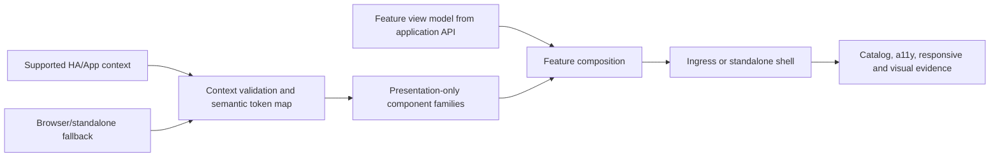

# Home Assistant-native UI foundation

- Status: Ready for review
- Date: 2026-09-20
- Catalog capability ID: `home-assistant-native-ui`
- Owners: Symphonia maintainers
- Scope: establish the shared shell, component families, semantic tokens, host-context adaptation, accessibility, responsive behavior, component catalog, and visual compatibility evidence for every Symphonia web view.
- Related requirements: `SYM-UI-001`–`SYM-UI-015`, `SYM-JOB-007`, `SYM-SEC-004`, `SYM-SEC-008`, `SYM-TEST-005`, `SYM-TEST-009`, `SYM-TEST-014`, `SYM-TEST-015`
- Related decisions/research: [ADR 0004](../docs/decisions/0004-home-assistant-native-ui.md), [UI specification](../docs/product/home-assistant-ui-specification.md), [official platform research](../docs/providers/provider-research.md#home-assistant-platform), [Gateway/HA UI evidence](../docs/providers/home-assistant-ecosystem-review.md#home-assistant-native-ui-lessons-from-homeassistant-gateway)
- Required review gates: product UX, Home Assistant platform, frontend architecture, accessibility, localization, testing/visual QA, documentation, security/privacy
- Open decisions blocking implementation readiness: supported Home Assistant/browser matrix; frontend framework/build selection; verified theme/locale/direction/safe-area context contract across supported Home Assistant versions; accepted visual-reference capture/update procedure

## 1. Executive summary

Every Symphonia web view will be built from one Home Assistant-native-adjacent compatibility layer. The layer owns semantic tokens, accessible presentation primitives, layout behavior, theme/locale/safe-area adaptation, and a deterministic component catalog. Feature views own content and use-case state but cannot invent duplicate controls or depend on private Home Assistant frontend internals.

The safe default is an independent, quiet operational UI that follows current Home Assistant patterns closely, works under arbitrary Ingress paths, and falls back deterministically in standalone mode.

```text
Public HA/App context + browser fallback -> semantic compatibility tokens
-> reusable component families -> feature view models from durable application state
-> Ingress/standalone shell -> behavioral, accessibility, responsive and visual evidence
```

## 2. Problem, current behavior, and evidence

### 2.1 Problem

Without a shared UI contract, each feature can implement different cards, buttons, forms, statuses, navigation, and responsive rules. The result may function but feel foreign inside Home Assistant, hide important partial/recovery states, and acquire an unstable dependency on the host frontend.

“Looks native” is otherwise subjective. It needs dated references, reusable component contracts, explicit allowed divergences, and acceptance evidence.

### 2.2 Current behavior

No complete Symphonia UI or UI package exists. The repository has an experimental Ingress metadata scaffold and prospective feature SDDs. This SDD does not select or authorize a frontend framework or production implementation.

### 2.3 Evidence and unknowns

- Accepted repository direction: [ADR 0004](../docs/decisions/0004-home-assistant-native-ui.md) and the [UI specification](../docs/product/home-assistant-ui-specification.md).
- Official evidence: Home Assistant design portal, frontend architecture/source, independent-component warning, current App/Ingress and safe-area contracts linked from the UI specification and platform research.
- Community evidence: `vypdev/homeassistant-gateway` commit `1ed75be` demonstrates a presentation-only compatibility layer, HA-like component families, component catalog, official-demo reference captures, accessibility/responsive tests, and visual baselines.
- Unknowns: exact supported Home Assistant/browser versions; selected frontend/build tools; the public context actually available to an Ingress App at each supported version; long-term token mapping; reference capture automation and review ownership.

## 3. Actors, surfaces, and terminology

| Actor | Goal | Entry point | Visible surfaces |
| --- | --- | --- | --- |
| Home Assistant administrator/user | Use Symphonia without learning an alien UI | Ingress panel | shell, navigation, connections, library, matching, copy, operations, diagnostics |
| Standalone user, if released | Use the same product semantics outside HA | authenticated standalone URL | same feature views with fallback host framing |
| Product/accessibility reviewer | Inspect every state before feature integration | component catalog and reference manifest | variants, themes, focus, viewports, long text, failures |
| Contributor | Compose consistent views without duplicating presentation behavior | public UI package entry point | tokens, components, layouts, stories/fixtures |
| Release operator | Detect host/frontend compatibility regressions | release evidence and supported matrix | Ingress smoke, screenshots, accessibility/responsive reports |

**Compatibility token** is a semantic Symphonia variable optionally mapped from supported host context. **Primitive** is presentation-only reusable behavior. **Catalog story/fixture** is deterministic isolated evidence. **Reference manifest** records dated official Home Assistant visual sources and provenance. **Intentional divergence** is a reviewed difference from the current official reference.

## 4. Goals, non-goals, and fixed invariants

### 4.1 Goals

1. Make every App view recognizably coherent with current Home Assistant.
2. Provide one reusable, accessible component vocabulary for all feature SDDs.
3. Isolate Home Assistant UI churn behind public context adapters and semantic tokens.
4. Prove behavior across themes, viewports, localization, accessibility settings, Ingress paths, and failure states.
5. Keep feature/application state independent from presentation and host-specific code.

### 4.2 Non-goals

1. Pixel-copying one Home Assistant release indefinitely.
2. Importing or forking the complete Home Assistant frontend.
3. Selecting a frontend framework in this SDD.
4. Defining each feature's domain content, actions, or state machine.
5. Making Symphonia a Lovelace card or replacing the Home Assistant shell.
6. Creating a decorative brand system that competes with operational status.

### 4.3 Fixed invariants

1. Feature views use the approved compatibility layer for existing component families.
2. Private Home Assistant modules, parent DOM traversal, private storage, and undocumented CSS selectors are prohibited dependencies.
3. No theme, viewport, locale, provider content, or animation preference may remove semantic status, focus, or required actions.
4. Presentation components contain no provider calls, secrets, domain policy, persistence, or operation orchestration.
5. Ingress and standalone render the same product state and action semantics.
6. Visual similarity never weakens accessibility, security, sanitization, or truthfulness.

## 5. Product journey

| Stage | Proposed behavior | User/operator effect |
| --- | --- | --- |
| Resolve host context | Accept supported theme/locale/direction/safe-area/base-path facts and validate them | UI matches its host without trusting arbitrary parent state |
| Bootstrap | Apply fallback tokens immediately, then bounded host context without geometry flash that hides content | First meaningful state is readable and stable |
| Navigate | Render one responsive shell and current-section semantics | User understands location at wide and narrow widths |
| Interact | Compose standard component families with feature view models | Controls behave consistently across journeys |
| Update | Re-render from authoritative application state with bounded announcements | Long operations remain understandable after navigation/reconnect |
| Review | Exercise catalog, accessibility, responsive, and official-reference comparison | “Native-adjacent” has inspectable evidence |
| Upgrade | Revalidate supported HA versions/tokens/context and intentional divergences | Host changes cannot silently break the App UI |



Text equivalent: validated public host context or deterministic fallback feeds semantic tokens; reusable presentation families combine with feature-owned view models inside one shell; catalog and browser evidence verify the result.

## 6. Functional behavior and state model

### 6.1 Happy path

1. The shell resolves base path and renders readable fallback tokens without blocking on Home Assistant context.
2. A context adapter accepts only the documented host message/origin/shape and maps supported theme, locale, direction, timezone, and safe-area facts.
3. Navigation loads a feature route and preserves history under the Ingress prefix.
4. The feature requests application state; loading is textual and non-destructive.
5. The view composes only approved component families and renders the durable state plus available actions.
6. Updates replace relevant view state, preserve focus where possible, and announce only material transitions.
7. The same fixtures render in catalog, light/dark and narrow/wide checks, and reviewed visual comparisons.

### 6.2 Alternative and boundary paths

- Missing, malformed, unsupported, or late host context keeps the deterministic fallback and records a sanitized compatibility reason.
- Host theme/locale changes update tokens/content without losing unsaved form state or focus.
- Unknown routes show a native-adjacent not-found surface with a safe return action; they never escape the Ingress base path.
- Connection loss preserves last safe state, labels it stale, and offers bounded reconnect behavior.
- Large tables/diagnostics scroll inside explicit containers or switch to a responsive record layout; the document does not overflow horizontally.
- Long translations, RTL, zoom, safe-area insets, and virtual keyboards reflow without covering primary actions.
- Unsupported future Home Assistant context fields are ignored rather than treated as trusted configuration.

### 6.3 UI shell/context states

| State | Entered when | User-visible meaning | Allowed next states | Recovery/owner |
| --- | --- | --- | --- | --- |
| `bootstrapping` | shell/assets loaded; application/context pending | Symphonia is opening; no outcome implied | `loading`, `ready`, `degraded`, `blocked` | automatic |
| `loading` | route/application request active | Named data/state is being loaded | `ready`, `empty`, `degraded`, `blocked` | automatic/retry |
| `ready` | view state and applicable context are valid | Current feature is available | `loading`, `degraded`, route change | user/system |
| `empty` | valid response has no applicable items | Nothing exists yet and next action is explicit | `loading`, `ready` | user/system |
| `degraded` | stale/offline/host-context limitation but safe local view remains | Named limitation; retained data/actions explicit | `ready`, `blocked` | retry/user action |
| `blocked` | unsafe/auth/application failure prevents the view/action | Impact, cause, next action, retained state | `loading`, `ready` after correction | user/operator |

Feature states such as partial, waiting-user, failed, and completed remain owned by their SDDs and use the shared state/feedback components.

## 7. Configuration contract

| Input | Type | Recommended default | Allowed values/range | Scope/persistence |
| --- | --- | --- | --- | --- |
| Theme mode | enum | follow validated Home Assistant context, then browser preference | `host/auto`, `light`, `dark` only if product permits override | user/browser preference; never domain state |
| Locale | BCP 47 tag | validated HA locale, browser locale, then English | packaged supported locales with base-language fallback | user/browser; server retains typed values |
| Text direction | enum | derived from locale/public host context | `ltr`, `rtl` | derived, not arbitrary per component |
| Safe-area handling | enum | supported host insets with zero fallback | host-managed or App-managed accepted profile | deployment/profile |
| Visual reference manifest | versioned document | latest reviewed supported HA release/reference date | immutable historical entries plus current pointer | repository/release evidence |
| Motion | media/user preference | system reduced-motion contract | normal or reduced | browser preference |

Users cannot configure away visible focus, semantic errors, required confirmations, accessible names, secret redaction, or the Home Assistant-native component hierarchy. Feature code cannot override tokens with unreviewed hard-coded palettes.

## 8. Clean Architecture design

### 8.1 Responsibilities and dependency direction

| Boundary | Owns | Must not own/import |
| --- | --- | --- |
| Product UI policy | component/state/compatibility invariants and permitted divergences | framework APIs, provider/domain logic |
| Application/API presentation | authenticated view models, action DTOs, persisted-state mapping | component geometry/theme decisions |
| UI compatibility package | semantic tokens, primitives, layouts, interaction/accessibility behavior | API clients, application/domain models, provider calls |
| Feature views/controllers | compose view models, call use cases, route-level state/focus | duplicate primitives, domain decisions |
| HA context adapter | validated public message/context mapping, base path, safe area | parent DOM/private storage, music policy |
| Shell/composition | routing, localization loading, theme selection, package wiring | feature business rules |
| Catalog/reference tooling | deterministic stories, public-demo reference provenance, visual/a11y/responsive evidence | live HA/provider/user data |

### 8.2 Contracts, durable state, and trust boundaries

- Pure decisions: token fallback/mapping, component variants, responsive layout selection, status tone/content, locale fallback, safe-area geometry.
- Application contracts: feature view models and commands with explicit loading/empty/partial/action/error facts.
- Ports/adapters: host-context source, locale catalog loader, history/base-path router, clock only for formatted relative time, diagnostic correlation.
- Durable state: none owned by primitives; user-safe preferences may persist separately, while feature truth remains server-side.
- Concurrency: stale route/API/context results are fenced or cancelled; late results cannot overwrite a newer navigation/action.
- Trusted/untrusted inputs: parent messages, URL/base path, theme names/tokens, locale tags, translations, provider/user content, diagnostic text, and API errors are untrusted until validated.
- Error mapping: UI receives stable safe categories and prepared user actions, never raw exceptions/provider bodies.

### 8.3 Executable architecture constraints

- Static dependency checks prohibit API/controller/application/domain/HA-private imports from the UI compatibility package and catalog fixtures.
- A single public package entry point exposes approved component families; compatibility re-exports contain no separate implementation.
- Token linting rejects hard-coded feature colors/spacing/radii outside approved token/provider-brand definitions.
- Route tests enumerate non-root base paths, refresh, deep links, assets, HTTP, and push transports.
- Context tests validate allowed origin/message/schema and fallback behavior; unsupported fields remain inert.
- Component semantics are exercised by interaction/accessibility tests, not source-string assertions alone.

## 9. UI/UX and content contract

### 9.1 Information hierarchy

1. Home Assistant-like page heading/current section and contextual action.
2. Current status and primary user goal.
3. Completed facts and material evidence.
4. What happens next and whether action is required.
5. Impact, retained state, and safe recovery action.
6. Collapsed sanitized technical details.

### 9.2 Representative states

```text
Opening Symphonia
Loading connection status. Your running operations continue in the background.
```

```text
No provider connections
Connect a supported music service to import playlists. Review access basis and permissions before leaving Symphonia.
Primary action: Add connection
```

```text
Library available with limitations
The latest Spotify import is incomplete; the complete library from 09:14 remains visible.
Action: Retry the failed playlist. No existing entries were removed.
```

```text
Symphonia needs attention
This view cannot confirm current operation state because the service is unavailable.
Action: Retry connection or open diagnostics.
Retained state: the last confirmed status is shown as stale; no provider write is being inferred.
```

```text
Copy completed with omissions
113 entries were confirmed and 4 explicitly accepted omissions remain listed.
Primary action: Review result
```

### 9.3 Accessibility and localization

- Locale/direction/timezone use validated public HA context with region-to-language-to-English fallback.
- Navigation, tabs, dialogs, fields, lists/tables, row actions, loading, and feedback follow native HTML or complete ARIA patterns.
- Focus survives passive refresh; dialogs trap and restore focus; route/action errors move focus only when required to recover.
- Mobile/narrow layout preserves headings, current status, primary action, and recovery facts; bounded containers own intentional scrolling.
- Provider/user/translation content is escaped, bidi-isolated where needed, length-bounded, and never executable markup.

## 10. Failure, recovery, and cleanup

| Failure/partial state | User impact | Retained facts | Automatic retry | Required action | Cleanup |
| --- | --- | --- | --- | --- | --- |
| Host context absent/malformed | fallback theme/locale/safe area | feature state unaffected | bounded re-subscribe if documented | none | discard invalid message |
| Theme/locale update fails | prior valid presentation remains | selected route/form state | reload catalog/context once | choose fallback/reload if persistent | no preference corruption |
| Route/asset base-path error | view/action unavailable | server operations continue | no loop | return/reopen App; diagnostics | invalidate bad client route cache |
| API disconnect during read | current data labeled stale | last confirmed view and correlation | bounded reconnect | retry if exhausted | cancel superseded requests |
| API disconnect after action | outcome unknown in browser | server operation/idempotency reference | fetch authoritative state | inspect operation; never repeat blindly | clear transient button loading after reconciliation |
| Component render/translation defect | affected content unusable | application state server-side | error boundary once | reload/report safe diagnostic | no secret/raw state dump |
| Unsupported HA frontend change | possible visual/context mismatch | independent fallback works | no speculative adaptation | release compatibility update | record divergence/reference update |

## 11. Security, permissions, and privacy

1. Ingress identity is trusted only at the verified server boundary; theme/locale messages do not grant authorization.
2. Parent-window messaging validates origin, type, correlation, and bounded schema; no wildcard data is executed or persisted blindly.
3. Provider/user/diagnostic strings cannot become markup, CSS, script, unsafe URLs, route destinations, or component definitions.
4. UI fixtures, screenshots, clipboard, downloads, browser logs, and error boundaries exclude secrets and real private account/library data.
5. Destructive actions use explicit consequences and confirmation; visual similarity cannot weaken server authorization or idempotency.

## 12. Observability and operational UX

- A sanitized client compatibility view exposes UI version, resolved theme/locale/direction/safe-area profile, route/base-path mode, connectivity, and reference-manifest version—not tokens, parent messages, or content.
- Client errors use bounded codes/correlation and aggregate component/route/context failures without provider/user text as metric labels.
- Loading/reconnect announcements are rate-limited; stable healthy state emits no repeated toast/notification.
- Visual mismatch is a release/test issue, not a user alert unless it makes a supported flow unusable.
- Browser state never supersedes the server's durable operation status.

## 13. Compatibility, migration, rollout, and rollback

- The UI package, token schema, translation catalog, API view models, and reference manifest are versioned.
- Each release declares supported Home Assistant and evergreen browser ranges; an unsupported host gets a clear compatibility warning only when evidence shows material risk.
- Token/context adapters tolerate absent new fields and ignore unknown fields; breaking renames require an explicit compatibility mapping and fixture.
- Component migrations occur family by family through the public package entry point; feature views do not straddle independent duplicate implementations indefinitely.
- Initial rollout may begin with catalog/reference evidence before feature views, then one operational vertical slice, then all remaining surfaces.
- Rollback serves a compatible prior UI/API asset set; mixed incompatible asset/API versions fail clearly and refresh safely rather than issuing malformed actions.

## 14. Testing strategy and numeric budget

Minimum **84 distinct cases**:

| Area | Minimum distinct cases | Behaviors/risks covered |
| --- | ---: | --- |
| Tokens/context/configuration/pure policy | 14 | host/fallback theme, locale, RTL, safe area, invalid context, token mapping, preferences |
| Component interaction and accessibility | 24 | every required family; keyboard/focus/ARIA; loading/disabled/error/destructive; announcements |
| Responsive/theme/locale geometry | 16 | light/dark/contrast/reduced motion, phone/tablet/desktop, zoom, long/RTL text, overflow |
| Shell/feature/Ingress/security contracts | 18 | arbitrary base path, deep link/refresh/assets/push, stale/cancelled requests, hostile content, secret canaries |
| Visual/reference/compatibility/release | 12 | dated HA comparisons, intentional divergence, snapshot review, supported host/browser upgrade/rollback |
| **Total** | **84** | No double counting |

Pure tests use fixed context messages, tokens, locales, translations, routes, and view models. Component/browser fixtures use no network and synthetic public-safe data. Browser behavior runs across the supported engine matrix; canonical pixel baselines may use one declared engine, while every engine must pass semantics and geometry contracts.

Required human evidence reviews official Home Assistant references versus the catalog and representative feature screens in light/dark, phone/wide, long-text, focus, action-required, partial, blocked, and completed states. Baseline updates require written review; they never self-approve.

## 15. Documentation and discoverability

| Audience | Artifact | Required content | Validation/navigation |
| --- | --- | --- | --- |
| User | UI/accessibility preferences guide | host theme/locale behavior, navigation, progress, reduced motion, fallback | linked from Help/About |
| Setup owner | Ingress/standalone presentation guide | base path, safe area, supported HA/browser matrix, compatibility diagnostics | install/upgrade checks |
| Operator | UI troubleshooting | blank/stale/context/theme/base-path symptoms and safe recovery | decision tree + sanitized diagnostic fixture |
| Contributor | component and content guide | tokens, families, composition, wording, accessibility, exceptions | catalog + architecture/lint gates |
| Reviewer | visual-reference manifest/runbook | provenance, capture version/date/viewports/themes, comparison and approval | release evidence index |

## 16. Acceptance scenarios

1. Given a supported Home Assistant Ingress panel, the shell adopts validated theme, locale, direction, safe-area, and base-path context while remaining recognizably consistent with official references.
2. Given absent, malformed, late, or unknown host context, a deterministic accessible fallback renders and no untrusted field changes authorization, navigation, CSS, or executable behavior.
3. Given light, dark, increased contrast/forced colors, or reduced motion, status, focus, structure, and all actions remain perceivable and usable.
4. Given keyboard-only use, every component family and representative feature flow supports visible focus, correct order, activation, dialog focus return, and non-disruptive announcements.
5. Given a phone viewport, safe-area insets, zoom, virtual keyboard, and long translated text, no essential state/action is clipped and no unexpected document-level horizontal overflow occurs.
6. Given an arbitrary Ingress prefix, direct/deep navigation, refresh, assets, HTTP calls, and any push connection resolve within that prefix and cannot escape to `/` accidentally.
7. Given loading, empty, ready, degraded/partial, action-required, failed/blocked, and completed feature fixtures, the UI uses shared families and truthful text rather than spinner/color/icon alone.
8. Given provider/user/translation/diagnostic strings containing HTML, Markdown, bidi controls, long tokens, unsafe URLs, or secret canaries, rendering and output remain bounded, inert, and secret-free.
9. Given two overlapping route/action/context requests, the stale result cannot overwrite the latest view or trigger a repeated mutation.
10. Given the standalone profile, the same feature states/actions/components render with documented fallback framing rather than a second product contract.
11. Given a proposed new component, it is rejected from feature use until its catalog covers applicable variants, themes, focus, accessibility, responsive, and long-content states.
12. Given a visual snapshot change, release evidence identifies the dated Home Assistant reference and records intended parity, accessibility/product divergence, or regression correction before approval.
13. Given a Home Assistant frontend/component migration, compatibility tests prove independent fallback and the supported matrix/reference manifest are updated before release.
14. Given a browser action whose response is lost, the UI reloads authoritative server state and never infers success or blindly repeats an irreversible operation.

## 17. Requirements traceability

| Requirement | Policy/use case/adapter/presentation | Test or evidence | Documentation |
| --- | --- | --- | --- |
| `SYM-UI-001`–`SYM-UI-003`, `SYM-UI-014` | product UI policy + compatibility package | component catalog, dependency/lint gates, dated HA comparison | component/content guide + ADR 0004 |
| `SYM-UI-004`, `SYM-UI-006` | tokens and component interaction | theme/contrast/motion + keyboard/ARIA/a11y browser matrix | accessibility/preferences guide |
| `SYM-UI-005`, `SYM-UI-012` | feature presentation + application view models | shared state fixtures, durable-state/reconnect races | feature SDDs and user guides |
| `SYM-UI-007`–`SYM-UI-008` | shell, router, HA context adapter | Ingress prefix, context schema/origin, safe-area/viewport tests | Ingress presentation guide |
| `SYM-UI-009` | presentation/output boundaries | hostile-content and secret-canary suite | security/content guide |
| `SYM-UI-010`–`SYM-UI-011`, `SYM-UI-015` | catalog/reference/release tooling | catalog completeness, visual review, HA/browser compatibility matrix | reference manifest/runbook |
| `SYM-UI-013` | composition profiles | Ingress versus standalone fixture parity | deployment guides |
| `SYM-TEST-005`, `SYM-TEST-009`, `SYM-TEST-014`, `SYM-TEST-015` | verification tooling | release gates | contributor testing guide |

## 18. Implementation sequence

1. Accept the supported Home Assistant/browser matrix, public context contract, visual-reference procedure, and frontend/build decision.
2. Establish reference manifest, semantic tokens, fallback context, package boundary, architecture/lint checks, and catalog harness.
3. Add foundational components: headings/toolbars, navigation/tabs, cards/sections, buttons/icon buttons, fields/choices, status/alerts, loading/empty, and layouts.
4. Add dialogs, settings/list rows, responsive data displays, safe-area/base-path shell, localization/direction, and full interaction/accessibility tests.
5. Integrate one vertical operational view and prove durable-state mapping, reconnect, hostile content, Ingress, standalone fallback, and representative visuals.
6. Migrate remaining feature views through the public package; complete compatibility matrix, documentation, visual review, and release evidence.

## 19. Definition of Done

- [ ] Status is `Ready for implementation` and explicit owner approval to implement exists.
- [ ] Supported HA/browser matrix, frontend/build, context/safe-area, and reference procedures are accepted.
- [ ] Every `SYM-UI-*` requirement maps to acceptance and deterministic or explicit human evidence.
- [ ] At least 84 distinct cases and architecture/lint/secret gates pass.
- [ ] Every required component family is available only through the public package and complete in the catalog.
- [ ] Representative feature states pass light/dark, contrast, reduced-motion, keyboard, screen-reader, narrow/wide, long/RTL text, and sanitization review.
- [ ] Ingress prefix, deep links, assets, reconnect/push, safe area, and standalone fallback are proven.
- [ ] Dated official reference manifest and reviewed visual evidence are current; all intentional divergences are documented.
- [ ] User/setup/operator/contributor/reviewer documentation is complete and discoverable.
- [ ] Catalog status/implementation evidence are current; no private HA dependency or readiness blocker remains.

## 20. References and decisions

- Primary sources: official Home Assistant links in the [UI specification](../docs/product/home-assistant-ui-specification.md) and [platform research](../docs/providers/provider-research.md#home-assistant-platform).
- Community evidence: pinned `vypdev/homeassistant-gateway` sources listed in the UI specification and ecosystem review.
- Related SDDs: [App runtime/Ingress](home-assistant-app-runtime-and-ingress.md), [provider connections](provider-connections-and-authorization.md), [imports](library-import-and-provider-projections.md), [identity resolution](recording-identity-resolution.md), [playlist copy](one-time-playlist-copy.md), [durable operations](durable-operations-and-recovery.md).
- Accepted: Home Assistant-native-adjacent direction, owned compatibility layer, no private HA frontend runtime dependency, shared Ingress/standalone semantics, dated catalog/reference evidence.
- Open: framework/build stack, supported matrix, public App context details, reference capture/update automation.
- Rejected: generic SaaS dashboard, private HA component imports by default, frozen pixel copy, decorative ambient UI, feature-local duplicate primitives.
