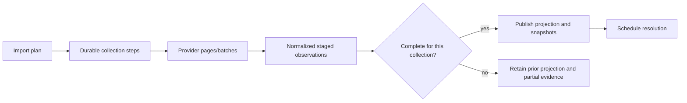

# Library import and provider projections

- Status: Draft
- Date: 2026-09-20
- Catalog capability ID: `library-import-and-provider-projections`
- Owners: Symphonia maintainers
- Scope: import approved provider collections and ordered playlists into complete, provenance-rich provider projections without confusing them with provider-independent recordings.
- Related requirements: `SYM-PROD-003`, `SYM-LIB-001`–`SYM-LIB-006`, `SYM-PROV-004`–`SYM-PROV-014`, `SYM-PROV-018`, `SYM-ARCH-004`–`SYM-ARCH-005`
- Related decisions/research: [domain model](../docs/domain/domain-model.md), [provider specification](../docs/providers/provider-specification.md), [provider research](../docs/providers/provider-research.md), [ADR 0004](../docs/decisions/0004-home-assistant-native-ui.md), [UI foundation](home-assistant-native-ui.md), `RG-001`, `OQ-007`, `OQ-008`
- Required review gates: product UX, domain, architecture, provider feasibility/policy, testing, documentation, privacy/operations
- Open decisions blocking readiness: proven collection semantics/completeness per MVP provider; retention/export policy; representative library sizes/import targets; provider-specific refresh/deletion obligations

## 1. Executive summary

An import is a durable observation of one provider connection, not a merge operation and not evidence that provider items are the same recording. It reads approved collections page by page, retains original identity/order/duplicates/availability/provenance, stages normalized projections, and marks previously observed items missing only after a complete authoritative result.

The safe default is full, read-only import after a connection succeeds, with no provider mutation and no deletion inferred from a partial/truncated run.

```text
Connected account -> plan approved collections -> page/batch reads
-> normalize provider projections -> validate completeness
-> atomically publish complete observations or retain partial evidence
-> schedule identity resolution separately
```

## 2. Problem, current behavior, and evidence

### 2.1 Problem

Provider libraries differ in collection meaning, pagination, unavailable/local/non-music entries, duplicate/order semantics, freshness, quotas, and data-retention rules. A naive import can silently truncate, erase missing items after a failed page, merge unrelated accounts, or store provider data indefinitely in violation of policy.

### 2.2 Current behavior

There is no importer or persistence implementation. The domain model and provider contract establish the required representation and completeness semantics; provider-specific facts still require live spikes.

### 2.3 Evidence and unknowns

- Shared model: [provider track, playlist, snapshot, and import invariants](../docs/domain/domain-model.md).
- Adapter contract: [pagination, unknown media, completeness, freshness](../docs/providers/provider-specification.md).
- Official API evidence and policy constraints: [provider research](../docs/providers/provider-research.md).
- Comparative warning: existing YT Music implementations may cap dynamic playlists or skip unavailable entries; [ecosystem review](../docs/providers/home-assistant-ecosystem-review.md#youtube-music).
- Unknowns: provider collection parity, target sizes, refresh cadence, raw payload retention, incremental cursor reliability.

## 3. Actors, surfaces, and terminology

| Actor | Goal | Entry point | Visible surfaces |
| --- | --- | --- | --- |
| Symphonia user | See current provider playlists/library with honest freshness | First import, refresh action, connection page | Library/playlist views, import progress/history |
| Provider adapter | Translate provider pages/items into normalized observations | Import use case | Contract outcomes and completeness evidence |
| Operator | Diagnose slow, partial, stale, or policy-blocked imports | Operation detail/diagnostics | Counts, pages, quota, reason codes, no raw secrets |
| Resolution engine | Consume provider-track projections after publication | Import completion event | Candidate/resolution queue |

**Provider projection** is the latest normalized view of an external object for a connection/context. **Import session** is one durable attempt over a declared set of collections. **Complete collection result** means every provider page/range required by the declared contract succeeded without unknown gaps. **Playlist snapshot** is an immutable ordered observation; it is not overwritten in place while an operation depends on it.

## 4. Goals, non-goals, and fixed invariants

### 4.1 Goals

1. Import saved/liked tracks and owned/followed playlists where an approved API exposes them.
2. Preserve provider identity, media kind, order, duplicates, unavailable entries, source timestamps, freshness, and policy metadata.
3. Make partial/truncated/stale results visible and safe.
4. Publish a stable input for resolution and copy planning.

### 4.2 Non-goals

1. Deciding recording identity during import.
2. Writing to provider libraries or playlists.
3. Treating generic YouTube videos as a complete YouTube Music catalog.
4. Keeping unrestricted raw API payloads forever.
5. Implementing continuous synchronization/change attribution.

### 4.3 Fixed invariants

1. Provider object IDs never become recording IDs.
2. External identity includes media type and any required instance/connection/catalog namespace.
3. Playlist order, duplicate occurrences, unknown media, and unavailable/deleted entries survive normalization.
4. Only a complete authoritative collection result may mark prior items no longer observed.
5. Raw provider data is separable/deletable from user-authored mappings and audit history.
6. Import failure cannot erase the last known complete projection.

## 5. Product journey

| Stage | Proposed behavior | User/operator effect |
| --- | --- | --- |
| Plan | Capture connection, adapter version, capability evidence, collections, and request/quota estimate | User sees what will be read and known limitations |
| Queue | Create one durable import operation with per-collection steps | Restart cannot lose intent/progress |
| Read | Page/batch through provider data with bounded timeouts/rate budget | Progress shows observed pages/items and waits |
| Normalize | Retain originals/provenance while mapping known fields/media states | Bad/unknown items become explicit issues, not silent drops |
| Validate | Determine completeness independently for each collection/playlist | One failed playlist need not invalidate every completed collection |
| Publish | Atomically publish complete collection observations and immutable playlist snapshots | Readers never see a half-replaced collection |
| Follow up | Schedule resolution for changed provider tracks | Matching remains separately auditable |



Text equivalent: each planned collection is read into staged normalized observations; complete results replace the current projection atomically, while incomplete results preserve prior truth and record partial evidence; published changes then feed resolution.

## 6. Functional behavior and state model

### 6.1 Happy path

1. A connected, capability-probed account creates an import plan for supported collections.
2. The use case snapshots adapter/version/capability/policy inputs and creates durable steps.
3. The adapter returns bounded pages with opaque continuation/revision evidence and explicit completeness.
4. Each object is validated and normalized with original values/provenance and observation/refresh metadata.
5. Each playlist produces an immutable snapshot with ordered occurrence records, including unavailable/unknown entries.
6. A complete collection transaction publishes the new projection, marks legitimately missing prior objects unavailable/no-longer-observed, and records counts/issues.
7. Changed/new provider tracks are offered to the resolution capability.

### 6.2 Alternative and boundary paths

- Empty complete collection is valid and may mark prior observations missing; empty incomplete result cannot.
- One malformed item is an item issue and affects completeness according to the provider contract; it is never silently discarded.
- Rate-limit wait persists and resumes without repeating published pages unsafely.
- Provider revision change during import either restarts/bounds the affected collection or publishes a snapshot explicitly labeled non-atomic/degraded; policy must be provider-specific and visible.
- Import cancellation preserves last complete projection and the partial session audit.
- A provider that cannot paginate or proves only a capped list reports `incomplete/degraded`, not success.

### 6.3 Import session and collection states

| State | Entered when | User-visible meaning | Allowed next states | Recovery/owner |
| --- | --- | --- | --- | --- |
| `planned` | collections/capabilities snapshotted | Ready to import | `queued`, `cancelled` | user/system |
| `queued` | durable work admitted | Waiting for worker/budget | `running`, `cancelled` | scheduler |
| `running` | collection lease held | Reading/normalizing provider data | `waiting_rate_limit`, `partial`, `failed`, `succeeded`, `cancelled` | worker |
| `waiting_rate_limit` | provider budget exhausted | Progress retained; resume scheduled | `running`, `failed`, `cancelled` | automatic |
| `partial` | some collections/items published or observed but operation incomplete | Last complete truth plus named partial results | terminal or explicit retry/new import | user/system |
| `failed` | no safe continuation within budget | Last complete projection retained | new import | user/system |
| `succeeded` | every requested collection reached declared terminal result | Current projection/freshness updated | terminal | none |
| `cancelled` | cooperative cancellation completed | No further reads; published complete steps remain | terminal | none |

Collection outcomes separately record `complete`, `complete_with_item_issues`, `incomplete`, `unsupported`, or `not_requested`.

## 7. Configuration contract

Exact names remain open, but behavior is bounded:

| Input | Type | Recommended default | Allowed values/range | Scope/persistence |
| --- | --- | --- | --- | --- |
| Collections | set | all approved MVP collections supported by the connection | adapter-declared stable collection IDs | snapshotted per import |
| Initial trigger | enum | immediately after verified connection | immediate or explicit manual start | connection preference |
| Periodic refresh | duration/off | unresolved pending provider policy/scale evidence | provider-safe bounded range | connection; next run snapshots |
| Request budget | bounded integer/profile | conservative adapter default | within adapter hard limits | snapshotted per run |
| Raw payload retention | policy | minimum needed for audit/debug under provider terms | accepted retention profiles only | install/connection policy |

Users cannot configure “ignore pagination errors,” “drop unavailable items,” “assume capped list complete,” or “delete prior state after partial import.”

## 8. Clean Architecture design

### 8.1 Responsibilities and dependency direction

| Boundary | Owns | Must not own/import |
| --- | --- | --- |
| Domain | External identity, provider projection, playlist snapshot/entry, availability, completeness invariants | Provider DTOs/database |
| Application | Plan/run/publish import, collection transaction and follow-up scheduling | Concrete paging/DB/job framework |
| Provider adapter | Page/batch calls, DTO normalization inputs, cursor/revision/error translation | Cross-provider deletion/match policy |
| Persistence adapter | Staging, atomic publication, historical references, retention | Provider API behavior |
| Presentation | Progress/freshness/issues/library projections | Inferring completeness or dropping items |

### 8.2 Contracts, durable state, and trust boundaries

- Pure decisions: external identity namespace, collection completeness, publish eligibility, missing-item transition, retention classification.
- Use cases: plan import, execute collection page, publish collection, cancel/retry, inspect session.
- Ports: provider reader, projection/snapshot repository, durable operation scheduler, clock, policy/retention, audit.
- Durable state: import plan/session, collection/page checkpoints, staged observation keys, complete projections, immutable snapshots, issues/freshness.
- Concurrency: at most one publishing import per connection/collection; overlapping read attempts fence publication by plan/session version.
- Untrusted inputs: every provider field, cursor, count, URL, timestamp, media type, and declared total.

### 8.3 Executable architecture constraints

- Shared contract suite proves pagination, completeness, identity namespace, unknown/unavailable preservation, timeouts, cancellation, and error mapping.
- Persistence tests prove incomplete sessions cannot mark prior objects missing and readers cannot observe half-publication.
- Dependency tests keep provider DTOs/SDKs outside domain/application and raw payloads outside general API/UI models.
- Policy tests enforce refresh/deletion metadata and provider-specific retention.

## 9. UI/UX and content contract

Library, playlist, freshness, progress, and import-result views conform to the [Home Assistant-native UI foundation](home-assistant-native-ui.md). They use shared headings/toolbars, filters/fields, status/alerts, progress and empty states, cards/sections, result rows, and responsive data displays. Dense tables may switch to list/record layouts or scroll only inside bounded containers; a provider-like artwork grid cannot hide completeness, freshness, provenance, unavailable entries, or required recovery.

### 9.1 Information hierarchy

Library/connection pages show current projection freshness and last complete import separately from the latest attempt. Progress is based on persisted counts and collection states, not transient events.

### 9.2 Representative states

```text
Importing Spotify
Status: Reading playlists · 18 playlists and 624 entries observed.
Completed: saved tracks.
Next: playlist pages continue after the provider rate-limit window. No action required.
Current library still reflects the complete import from 09:14.
```

```text
Import partially completed
Saved tracks and 17 playlists were updated. “Road trip” could not be read after page 3.
Action: Retry that playlist or keep the previous complete snapshot.
Retained state: no entries were removed from “Road trip”.
```

```text
Import complete
1,842 saved tracks and 24 playlists were observed. 3 unavailable entries were preserved and need no immediate action. Resolution has been queued for 126 changed tracks.
```

### 9.3 Accessibility and localization

Progress never depends on an indeterminate spinner alone; counts and collection names are textual. Tables retain a list/card alternative at narrow widths. Provider/user text is escaped, bidi-safe where possible, length-bounded, and never rendered as HTML/Markdown. Timestamps show configured locale/timezone with UTC retained internally.

## 10. Failure, recovery, and cleanup

| Failure/partial state | User impact | Retained facts | Automatic retry | Required action | Cleanup |
| --- | --- | --- | --- | --- | --- |
| Page timeout before response | import delayed | checkpoint before page | bounded backoff | none unless budget exhausted | staged duplicates deduped by observation key |
| Malformed/unknown item | item issue; collection completeness explicit | raw-minimal/sanitized evidence and position | no blind item loop | adapter fix or user review | retention applies |
| Auth revoked | import waits for user | last complete projection/session checkpoint | no | reconnect | transient page state expires |
| Rate limit | import pauses | progress and retry time | provider-aware | none | no duplicate publication |
| Provider changes mid-read | atomicity degraded/collection restarted | revisions/pages/session | bounded provider policy | retry if exhausted | discard superseded staging |
| Cancellation | no further reads | published complete steps and audit | no | start new import | remove orphan staging after safe horizon |
| Partial/truncated list | freshness not advanced as complete | last complete projection plus partial evidence | bounded retry | user/provider fix | never mass-delete |

## 11. Security, permissions, and privacy

1. Imports use minimum read scopes and never acquire write capability merely for convenience.
2. Provider IDs/URLs/names/cursors are opaque data and cannot drive filesystem paths, arbitrary requests, redirects, or code loading.
3. Raw payload storage is minimized, encrypted/classified where required, expiry-tagged, and independently deletable.
4. Logs/metrics avoid full playlist contents and stable provider IDs unless an accepted privacy policy permits bounded correlation.
5. Export/diagnostic views are bounded, previewable, sanitized, and omit tokens/auth headers.

## 12. Observability and operational UX

- Import operations expose collection/page/item counts, completeness, prior/current freshness, wait/retry, quota where known, adapter version, and issue categories.
- Metrics cover duration, pages/items, incomplete results, stale age, rate limits, normalization issues, and publication transactions.
- Correlation identifies operation/run/collection/page/connection/adapter without provider payload dumps.
- A waiting rate limit is not a failed import; a partial latest attempt does not overwrite the timestamp of the last complete result.
- Stable periodic success produces history/metrics but no notification unless the user requested it.

## 13. Compatibility, migration, rollout, and rollback

- Projection schemas and raw-normalizer versions are explicit; reparsing never erases originals still allowed by retention policy.
- External identity changes require a migration that detects collisions and preserves historical references.
- Adapter upgrades run fixture contract tests before publication and can invalidate/refresh projections without silently remapping recordings.
- Rollback reads only schema versions it declares compatible; otherwise App readiness blocks.
- Initial rollout imports one connection/collection set with write capabilities disabled.

## 14. Testing strategy and numeric budget

Minimum **72 distinct cases**:

| Area | Minimum distinct cases | Behaviors/risks covered |
| --- | ---: | --- |
| Domain/completeness/identity policy | 16 | empty/partial/complete, namespaces, order, duplicates, availability, freshness |
| State/application/idempotency/races | 16 | pagination checkpoints, overlap/fencing, cancellation, resume, atomic publication |
| Provider/persistence contracts | 18 | pages/cursors/revisions, malformed data, caps, rate/auth/errors, staging/transactions |
| HTTP/UI/accessibility/sanitization | 8 | running/waiting/partial/failed/complete, hostile metadata, timestamps, narrow views |
| Integration/security/migration | 14 | large fixtures, restart, retention cleanup, schema/adapter changes, secret/path abuse |
| **Total** | **72** | No double counting |

Fixtures include zero/one/boundary/multi-page collections, duplicate playlist occurrences, unavailable/deleted/local/non-music/unknown items, colliding IDs across types/instances, revision change mid-read, and provider-declared totals that lie. Live smoke is opt-in and verifies only dated documented behavior with dedicated data.

The eight feature-specific UI cases supplement the UI-foundation budget and inherit its component-catalog, host-context, accessibility, responsive geometry, theme/localization, hostile-content, and dated visual-reference gates.

## 15. Documentation and discoverability

| Audience | Artifact | Required content | Validation/navigation |
| --- | --- | --- | --- |
| User | Library/import guide | collections, freshness, manual refresh, unavailable items | UI fixtures |
| Setup owner | Provider import limits | scopes, quota, schedule, retention | adapter capability matrix |
| Operator | Import troubleshooting | partial vs failed, retry, stale data, cleanup | error decision tree |
| Contributor | Import architecture/contract | completeness, staging, identity, fixtures | common contract suite |

## 16. Acceptance scenarios

1. Given a complete multi-page collection, every item is published once with provenance/freshness and the collection advances its complete timestamp.
2. Given an empty complete result, prior observations become no-longer-observed; given empty incomplete output, prior state is untouched.
3. Given duplicate playlist entries and unavailable/unknown media, the snapshot retains every occurrence/position and explicit state.
4. Given a timeout/rate limit/restart after page N, resume uses durable checkpoints and cannot publish duplicate or half-replaced state.
5. Given a malformed item or capped/non-pageable provider list, the UI reports explicit item/completeness issues rather than silently claiming success.
6. Given overlapping imports, only the non-superseded fenced session may publish a collection.
7. Given cancellation, no new pages run, complete published steps remain true, incomplete staging cannot delete prior projections, and cleanup is bounded.
8. Given provider disappearance, user-authored resolution/audit data remains while provider payload retention transitions independently.
9. Given hostile provider IDs/URLs/names/cursors, no path/egress/render/log injection or secret disclosure occurs.
10. Given a completed import, only changed/new provider tracks are scheduled for separate resolution with no identity decision made by import.
11. Given empty, importing, rate-limited, stale, partial, failed, and complete fixtures with long provider text and dense ordered entries, the shared Home Assistant-native components preserve textual completeness/freshness, keyboard access, bounded scrolling, and essential actions at narrow and wide widths.

## 17. Requirements traceability

| Requirement | Owner | Test or evidence | Documentation |
| --- | --- | --- | --- |
| `SYM-LIB-001`–`SYM-LIB-006` | domain/import use cases/presentation | projection/snapshot/application fixtures | library/import guide |
| `SYM-PROV-004`–`SYM-PROV-008` | provider contract | shared pagination/media/error suite | provider adapter guide |
| `SYM-PROV-011`–`SYM-PROV-014` | adapter/scheduler/retention | rate/live-isolation/policy tests | provider limits/privacy guide |
| `SYM-PROV-018` | identity policy | cross-type/instance collision fixtures | domain architecture |
| `SYM-ARCH-004`, `SYM-ARCH-005` | persistence/retention | deletion/history/migration tests | retention/recovery guide |
| `SYM-TEST-003`, `SYM-TEST-006`, `SYM-TEST-010`, `SYM-TEST-011` | verification tooling | release gates | contributor testing guide |

## 18. Implementation sequence

1. Complete provider feasibility, retention, scale, and collection-scope decisions.
2. Define projection/snapshot/import contracts and failing common adapter tests.
3. Implement pure identity/completeness/publication policy and tests.
4. Implement application use cases with fake provider/persistence/job ports.
5. Implement persistence staging/publication and one provider read adapter.
6. Add progress/library UX, retention cleanup, docs, migration and bounded live evidence.

## 19. Definition of Done

- [ ] Collection semantics, retention, scale, and provider-policy blockers are resolved.
- [ ] Every requirement and state maps to acceptance and deterministic tests.
- [ ] At least 72 distinct cases and common adapter/persistence gates pass.
- [ ] Partial/truncated imports cannot erase or masquerade as complete state.
- [ ] Identity namespace, order, duplicates, unavailable/unknown media, and provenance are preserved.
- [ ] Raw payload retention/deletion, diagnostics, and privacy are implemented/documented.
- [ ] Running/waiting/partial/failed/completed UX passes accessibility/sanitization review.
- [ ] Live smoke remains opt-in and catalog evidence is current.
- [ ] Explicit owner approval to implement exists.

## 20. References and decisions

- Primary sources: [provider research](../docs/providers/provider-research.md) and provider links therein.
- Related SDDs: [connections](provider-connections-and-authorization.md), [identity resolution](recording-identity-resolution.md), [durable operations](durable-operations-and-recovery.md).
- Related UI contract: [Home Assistant-native UI foundation](home-assistant-native-ui.md) and [ADR 0004](../docs/decisions/0004-home-assistant-native-ui.md).
- Accepted: provider projections remain distinct from recordings; only complete results can infer missing items.
- Rejected: silent truncation, skipping unavailable entries, delete-on-partial, matching during import.
- Follow-up: incremental imports and persistent sync after official evidence and baseline semantics exist.
