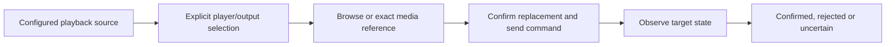

# Listening and playback control

- Status: Draft
- Date: 2026-09-28
- Catalog capability ID: `listening-and-playback-control`
- Owners: Symphonia maintainers
- Scope: browse playable content, choose an explicit playback source and output, observe now-playing state, and control a configured external player from the Home Assistant-integrated Symphonia UI.
- Related requirements: `SYM-PLAY-001`–`SYM-PLAY-009`, `SYM-PROV-021`–`SYM-PROV-022`, `SYM-UI-016`, `SYM-HA-011`, `SYM-ARCH-016`, `SYM-ACC-005`, `SYM-UI-001`–`SYM-UI-015`, `SYM-SEC-004`, `SYM-SEC-008`
- Related decisions/research: [product specification](../docs/product/product-specification.md), [domain model](../docs/domain/domain-model.md), [provider specification](../docs/providers/provider-specification.md), [system architecture](../docs/architecture/system-architecture.md), [ADR 0006](../docs/decisions/0006-narrow-home-assistant-playback-broker.md), [official playback research](../docs/providers/provider-research.md#2026-09-28-playback-and-home-assistant-api-update), [ecosystem review](../docs/providers/home-assistant-ecosystem-review.md), [integration source review](../docs/providers/playback-integration-source-review.md), [full-scope proof plan](../docs/development/playback-release-gates.md), [UI foundation](home-assistant-native-ui.md), [App runtime](home-assistant-app-runtime-and-ingress.md), `OQ-011`, `RG-007`
- Required review gates: product UX, Home Assistant platform/API, provider feasibility, architecture, accessibility, testing, documentation, security/privacy
- Open decisions blocking readiness: `OQ-011` complete supported playback-profile matrix and broker transport/pairing/identity contract (the narrow-broker authority choice is accepted); `RG-007` Spotify idle-start/exact-device feasibility, account/source/player binding, MA caller identity and playlist-reference evidence; whether an explicitly consented direct Spotify Connect complement is authorized; broker threat/version/upgrade review; live-state freshness and command-reconciliation thresholds; Music Assistant/community YouTube Music support policy

## 1. Executive summary

Symphonia should feel like a focused Home Assistant music surface: after setting up a library provider and a separate compatible playback source, a user can choose what to hear and where, see what that selected player reports now, and operate only controls it supports. The same App retains Symphonia's higher-assurance playlist import, identity resolution, and copy workflows. [ADR 0006](../docs/decisions/0006-narrow-home-assistant-playback-broker.md) selects a narrow companion integration that alone reads/commands explicitly allowed Home Assistant `media_player` entities; the App uses a typed broker port and does not stream or decode audio.

The owner rejected an active-session-only Spotify release as the complete product. The intended acceptance covers starting/switching playlists, exact output selection, now-playing and supported transport across the accepted Spotify and Music Assistant/YouTube Music profiles. Development may proceed in internal increments, but no narrower increment may be advertised as complete. The [release proof plan](../docs/development/playback-release-gates.md) separates that target from currently demonstrated provider behavior; impossible or unsafe upstream operations require an explicit exception or a separately approved route, not a fabricated control.

The primary correctness rule is **no inferred authority**: an imported Spotify playlist, a Home Assistant Spotify entity, a Music Assistant source, and a speaker may refer to different accounts or devices. A title match, shared provider name, or successful action request never proves the intended media is playing on the intended output.

```text
Configure library connection (optional for listening) + configure HA playback source
-> explicitly link source/account and select target/output
-> browse supported media or exact compatible imported playlist
-> confirm replacement target -> send one bounded command
-> observe player state -> show confirmed, pending, or uncertain result
```

## 2. Problem, current behavior, and evidence

### 2.1 Problem

A user may connect providers and manage playlists but still need to leave Symphonia to listen. Treating library connection as playback authorization would leak authority and promise controls or account coverage that the underlying Home Assistant integration does not expose. Polling and remote device behavior also make accepted commands distinct from confirmed playback.

### 2.2 Current behavior

No Symphonia listening route, playback port, companion playback broker, player discovery, or now-playing implementation exists. The prior product specification explicitly excluded playback and the App-runtime SDD excluded exposing playback entities. This SDD changes the proposed product boundary; it is **Draft** and creates no production implementation permission. Existing import/copy foundations and the synthetic UI spike are not playback evidence.

### 2.3 Evidence and unknowns

- Repository decisions: App + Ingress, independent Home Assistant-native UI, and provider-neutral core remain accepted; see [ADRs](../docs/decisions/README.md). Provider research keeps official API claims separate from [community implementation evidence](../docs/providers/home-assistant-ecosystem-review.md).
- Official Home Assistant sources reviewed 2026-09-28: [Spotify integration](https://www.home-assistant.io/integrations/spotify/) exposes playback/browsing, source selection and playlist `play_media`, requires Premium and a known compatible device, and polls at least every 30 seconds; [Music Assistant integration](https://www.home-assistant.io/integrations/music_assistant/) exposes player entities/current media and controls; [media-player entity contract](https://developers.home-assistant.io/docs/core/entity/media-player/) defines optional state fields and feature flags; [App communication](https://developers.home-assistant.io/docs/apps/communication/) documents the Core API proxy and `SUPERVISOR_TOKEN`; [WebSocket API](https://developers.home-assistant.io/docs/api/websocket/) documents state-change events and service calls.
- Official Spotify source: [currently playing](https://developer.spotify.com/documentation/web-api/reference/get-the-users-currently-playing-track) and [start/resume playback](https://developer.spotify.com/documentation/web-api/reference/start-a-users-playback) demonstrate an alternative direct adapter, but require separate scopes/account/device/policy review; no direct Spotify adapter is selected here.
- Community/project evidence: [Music Assistant's YouTube Music source](https://www.music-assistant.io/music-providers/youtube-music/) uses unofficial access, cookies and a PO-token service; [`ytube_music_player`](https://github.com/KoljaWindeler/ytube_music_player/blob/main/README.md) is another community playback path. Neither establishes official Google support or universal observation of the native YouTube Music app's external sessions.
- The dated [integration source review](../docs/providers/playback-integration-source-review.md) identifies specific stock-HA constraints: Spotify's idle/restricted state removes `PLAY_MEDIA` and WebSocket browse; device selection is name-based and can be ambiguous; MA's active source is not always an MA queue, its broad feature flags do not prove effect, its name fallback is unsafe for exact playback, and its per-user behavior depends on the HA caller context. These findings narrow the `RG-007` live probes; none is a release guarantee on unpinned versions.
- Accepted authority boundary: the companion broker, not the broad Supervisor Core proxy, under ADR 0006. Unknowns: broker transport/pairing/version/caller contract and threat review; how HA entity identity/account is verified; exact imported-playlist-to-source mapping; target/source behavior across Spotify, Music Assistant and community players; private/session metadata behavior; timing, action error, and coexistence with other HA clients on target hardware.

## 3. Actors, surfaces, and terminology

| Actor | Goal | Entry point | Visible surfaces |
| --- | --- | --- | --- |
| Home Assistant administrator | Configure/authorize playback bridge and link sources/targets | Ingress setup | permissions, integrations, bindings, supported/unsupported reasons |
| Listener | Choose music/output and control the selected session | Ingress Listen route | browse/search when exposed, now playing, source/output picker, transport |
| Home Assistant companion broker | Observe allowed Core entities and dispatch typed, bounded actions | authenticated versioned broker channel | setup/health, never raw Core API in browser |
| Home Assistant Core/player integration | Report entity state and accept supported actions | broker only | none directly in browser |
| Operator | Diagnose absent/stale/ambiguous playback without exposing accounts | diagnostics | sanitized integration health and command category |

**Playback source** identifies an approved configured service/account, not necessarily an imported provider connection. **Player target** is one exact entity or endpoint; **output** is an integration-specific destination. **Observation** is an ephemeral, timestamped report from the player, not a canonical library fact. **Binding** is an explicit relation between a source/player and an optional library connection, with verified or visibly unverified account evidence. **Command result** is `pending`, `confirmed`, `rejected`, or `uncertain` based on observation, not merely transport acceptance.

## 4. Goals, non-goals, and fixed invariants

### 4.1 Goals

1. Make selecting media and output, now-playing display, and available controls usable in a familiar Home Assistant-like view.
2. Preserve Symphonia's playlist-management experience alongside listening, without conflating playback queue changes with durable playlist edits.
3. Complete an evidence-backed Spotify and Music Assistant/YouTube Music listening profile, including starting and switching playable playlists on an exact compatible output. Each profile uses the same capability-driven UI but may have genuinely different supported controls and setup requirements.
4. Degrade playback independently of the library/import/copy system.

### 4.2 Non-goals

1. Streaming, downloading, decoding, transcoding, or mixing audio in Symphonia.
2. Universal observation/control of arbitrary provider apps, browsers, devices, or accounts outside the selected integration.
3. Building a second Music Assistant server, a general Home Assistant API browser, or a generic service-call console.
4. Queue editing, multi-room synchronization, cross-service handoff, and playback history/scrobbling in this contract. Starting a different playlist is in scope; editing the active queue or a saved playlist is not. Queue read and richer controls require their own verified capability and scope decision.
5. Changing the playlist-copy safety/confirmation contract; starting a playlist changes playback only, not the provider playlist.

### 4.3 Fixed invariants

1. No player/output is selected solely from a provider type, mutable display name, last active device, or imported playlist.
2. `unknown`, stale, unsupported, or missing effective capability never enables a command. A feature bit is necessary but not sufficient for a source-specific media reference.
3. A selectable output is not a verified output identity: ambiguous names, idle first-device fallback, stale device lists, or an unobserved transfer block an exact-output claim. A profile that cannot meet “play here” remains read-only/limited or unavailable for that action until a separately approved path exists.
4. A transport-accepted command is not shown as effect-confirmed. Ambiguous outcomes are read/reconciled, never blindly retried.
5. No browser-side Core/Supervisor token, arbitrary Home Assistant service/domain, arbitrary media URL, local path, or provider refresh grant is exposed. MA's title-search fallback is not an exact reference.
6. Library data and copy state remain usable when the playback bridge is offline, and listening observations never silently update recording identity or imported snapshots.
7. Unofficial YouTube Music paths remain opt-in and visibly unofficial/best-effort; an official YouTube Data connection is not relabeled YouTube Music playback.
8. A server-side App action is not assumed to carry the Ingress listener's HA/MA identity. Private browsing or per-user playback is blocked until caller attribution and account authorization are proven.

## 5. Product journey

| Stage | Proposed behavior | User/operator effect |
| --- | --- | --- |
| Set up | Show library connection and playback-source setup separately; explain extra HA/MA integration and permission | No false “connected means playable” promise |
| Bind | Choose an allowed source/account and exact HA entity; show verified or unverified association | Wrong account/player cannot be hidden behind a provider logo |
| Select | Pick content from supported source browser or an exact compatible imported item; pick explicit player/output | User sees target and media before replacing playback |
| Start | Issue one command and show pending, then observe target state | Accepted request is not mislabeled success |
| Control | Show current metadata/freshness and controls the player currently supports | Pause, stop, skip, seek or output changes have accurate meanings |
| Recover | Explain stale/offline/unsupported/ambiguous states and safe next action | Library/playlist work remains available |



Text equivalent: a separately configured source and explicitly chosen target precede content selection; a bounded command is sent only after target/content confirmation, then observation determines its visible result.

## 6. Functional behavior and state model

### 6.1 Happy path

1. Administrator installs/pairs the narrow broker and selects allowed `media_player` entities; Symphonia discovers their state and effective features through the broker without holding a broad Core credential or putting broker credentials in the browser.
2. Listener opens Listen, selects an approved source and one target/output. If several sessions are active, the UI lists them instead of silently electing one.
3. The source presents playable tracks, albums, and playlists through supported browse/search capabilities, plus compatible imported playlists where an exact reference exists. Exact playback references are adapter-validated. A missing reference offers the source's own browser or a clear unsupported explanation. A browser route must pass its own HA feature/permission check; a method existing in an integration is insufficient.
4. User selects content, sees the target/current-playback replacement warning, and starts it **only if** that source/state/output profile is proven eligible. Command status stays pending until a bounded observation confirms the target's state, media and required output or becomes uncertain.
5. Now playing shows only reported fields: state, title, artist, artwork, position, context/playlist, target/source, and last observation. Transport/output actions depend on current effective capability and selected player.

### 6.2 Alternative and boundary paths

- A Symphonia provider connection exists but no HA playback source: library works; Listen shows setup guidance, not a fake player.
- HA Spotify is configured but has no known Spotify Connect device: now-playing may be idle; start/output explains the missing device. While idle or on a restricted device, stock HA Spotify advertises only source selection, not normal `play_media` or WebSocket browse. A separately approved browse-service route is unproven; no idle-start workaround is assumed.
- HA Spotify lists duplicate device names or an output selected by name cannot be freshly verified: keep “play here” disabled, even if `SELECT_SOURCE` is advertised. Source selection/transfer can alter an existing session and requires an explicit warning and effect observation.
- If a pinned HA-only Spotify route cannot meet the requested idle-start/exact-output contract in live tests, do not re-label an active-session-only prototype as complete. Evaluate an explicitly consented, device-ID-capable Spotify Connect complement only if the owner authorizes its separate grant, policy review and live proof; until then, this release gate remains open.
- MA reports an external active source with current media but no active queue: display that media without fabricating queue controls, next item or playlist context. A base HA feature flag alone does not enable queue-only actions.
- MA is invoked via a server-side Core bridge: verify the actual HA/MA caller mapping before showing private source results or attributing a play request to the listener; absent evidence, constrain to a configured single-admin/default-account profile or keep the path unavailable.
- Music Assistant has a YouTube Music source but no playable target or expired cookie/PO-token service: show source unavailable with its unofficial status; do not fall back to Google/YouTube Data or ask Symphonia for cookies.
- A community entity may report only sessions it manages: show its verified coverage limitation; do not claim visibility into playback begun in the official YouTube Music mobile app without specific evidence.
- An imported private playlist belongs to an unverified/different account: no automatic `play_media` from that import. Use the configured source browser or explicit user-approved compatible reference only after evidence.
- Two active players: show both, with one explicitly selected. Commands never target an area, device group, wildcard, or every `media_player` implicitly.
- A player reports `playing` but omits title/playlist/artwork: preserve `playing` and label missing metadata; never substitute last imported or last commanded item.
- A source becomes unavailable or HA disconnects: last observation is labeled stale, controls disable, bounded reconnect/read is attempted; no command queue is replayed when it returns.
- A request is accepted but observation does not match before the confirmation budget: mark `uncertain` and offer refresh/inspect in HA, not an automatic repeat.

### 6.3 State machine

| State | Entered when | User-visible meaning | Allowed next states | Recovery/owner |
| --- | --- | --- | --- | --- |
| `unconfigured` | no approved source/bridge | Listening needs setup; library unaffected | `idle`, `unavailable` | administrator |
| `no_target` | source exists, no explicit eligible player/output | Choose where to listen | `idle`, `unavailable` | listener |
| `idle` | fresh player report says idle/off or no active media | No current song on selected player | `pending`, `playing`, `paused`, `unavailable` | listener/external controller |
| `pending` | one authorized command awaits observed effect | Requested action not yet confirmed | `playing`, `paused`, `idle`, `uncertain`, `rejected`, `unavailable` | bounded observation |
| `playing` | fresh selected-player report says playing | Current reported media/controls available | `pending`, `paused`, `idle`, `stale`, `unavailable` | listener/external controller |
| `paused` | fresh selected-player report says paused | Reported media retained, if provided | `pending`, `playing`, `idle`, `stale`, `unavailable` | listener/external controller |
| `stale` | prior observation exceeds accepted freshness or stream lost | Last known state, not current fact; controls disabled | `idle`, `playing`, `paused`, `unavailable` | bounded refresh |
| `unavailable` | HA/source/player unavailable or permission denied | Playback unavailable; library continues | `idle`, `playing`, `paused`, `unconfigured` | reconnect/setup/operator |
| `rejected` | HA/integration explicitly refuses command | Nothing claimed to have changed | `idle`, `playing`, `paused`, `stale` | listener fixes target/permission |
| `uncertain` | command outcome or target effect cannot be confirmed | Do not repeat automatically | `idle`, `playing`, `paused`, `stale` after authoritative read | listener/refresh |

State reports and command results are separate dimensions: a later external action may change `playing` to `paused` without a Symphonia command. Out-of-order observations and old command responses are fenced by target, observation time/version, and command correlation. Player selection changes cancel the prior UI pending view but do not cancel an already accepted external effect.

## 7. Configuration contract

| Input | Type | Recommended default | Allowed values/range | Scope/persistence |
| --- | --- | --- | --- | --- |
| Playback broker | versioned, paired companion integration | disabled until pairing/threat review pass | one accepted authenticated broker profile; no Core proxy fallback | App/integration configuration |
| Allowed players | exact entity identifiers | none | discovered, validated `media_player` entities only; explicit selection | App configuration, backed up without HA token |
| Source/connection binding | typed identity and evidence | unbound | verified account match or visibly unverified user assertion | local configuration; cleared/reviewed on disconnect |
| Preferred target | exact allowed player/output reference | none | one existing eligible target; no wildcard/area default | user preference; invalidated when entity/source disappears |
| Observation/command budget | bounded policy | conservative fixed defaults after `RG-007` | documented freshness/timeout ranges, never unbounded rapid polling | deployment policy; no per-request override |

Migration from an earlier install adds no automatic binding or allowed target. If an HA entity is renamed/recreated, the stored selection becomes action-required rather than silently targeting a different entity. Security authorization, allowlisted actions, and secret exposure are not configurable downward.

## 8. Clean Architecture design

### 8.1 Responsibilities and dependency direction

| Boundary | Owns | Must not own/import |
| --- | --- | --- |
| Domain/pure policy | target/source identity, freshness, capability intersection, command eligibility | HA constants/SDKs, provider DTOs, audio streams |
| Application | list targets/sources, bind, browse, observe, command, reconcile | direct HA/Spotify calls, UI layout |
| App playback adapter | broker DTO mapping, source-specific state/feature/media validation | provider library/copy policy, Core credentials, generic Core proxy |
| Optional direct Spotify Connect adapter, **only if separately accepted** | fresh device-ID and account-bound read/control mapping behind the same semantic ports | implicit reuse of HA/library grants, exposing tokens to browser/broker, fallback without user consent |
| Companion broker | HA entity observation and typed, exact-target Core action dispatch | Symphonia database/grants, arbitrary HA service proxy, music-domain policy |
| Infrastructure/composition | broker pairing, versioning, allowlist synchronization, bounded transport/subscriptions | implicit user account equivalence or broad App-to-Core authority |
| Presentation | listening view model, confirmation, pending/stale/uncertain feedback | token access, raw service dispatch, authority decisions |

### 8.2 Contracts, durable state, and trust boundaries

- Pure decisions: eligible target and source, playable reference validation, current action intersection, freshness, observed-effect matching, safe recovery choice.
- Effective feature policy is integration-specific: HA Spotify active versus idle/restricted, device-name uniqueness and freshness; MA queue versus external source, player capability and caller identity; optional community target-player capability. No generic HA bitmask alone proves the media/output effect.
- Application contracts: discover/select/bind source and target; browse supported media; read observation; issue one typed command with correlation; reconcile once/boundedly. Broker protocol/auth/identity and reconnect semantics remain a design gate, not a guessed WebSocket/MQTT choice.
- Semantic ports: player catalog, playback-source browser, exact-reference resolver, state observer, command dispatcher, clock, policy/permissions, sanitized audit.
- Durable state/schema ownership: only approved player allowlist, explicit binding/preference, and minimal command audit/correlation where required; now-playing media/title/artwork/position and full listening history are ephemeral by default. No operation-job checkpoint is created for ordinary transport control.
- Concurrency/idempotency: at most one unresolved command per selected player from Symphonia; external HA controllers can race; lost responses trigger observation, not automatic replay. A newly selected player fences old events/UI requests. Command audit distinguishes requested, accepted, observed, rejected, and inconclusive.
- Trusted/untrusted inputs: entity IDs, HA state/attributes, media-browser references, artwork URLs, remote source names, imported playlist IDs, and service errors are untrusted. Only adapter-owned validated mappings cross the Core boundary; MA's generic `play_media` acceptance of search text, URLs or local paths cannot broaden it.
- Error mapping: source absent, target absent, account unverified, permission denied, unsupported capability, no compatible device, stale state, integration unavailable, rate limit, and uncertain effect have distinct safe categories.

### 8.3 Executable architecture constraints

- Static tests reject HA/Supervisor and playback SDK imports in domain/application and Core-token/API imports in browser/presentation.
- Contract tests enumerate every broker read/action and reject arbitrary HA service domains, wildcard targets, unapproved entities, unchecked media URLs, stale feature claims, missing/rotated credentials, incompatible versions, and reconnect replay.
- Binding tests prove names/provider kinds cannot establish account or target identity.
- Command tests prove accepted response is not success, lost response is not replayed, and stale/out-of-order state cannot confirm the wrong target/content.

## 9. UI/UX and content contract

The Listen route composes the [Home Assistant-native UI foundation](home-assistant-native-ui.md): existing shell/navigation, cards, settings rows, selectors, dialogs, status/alert, loading/empty, and the shared now-playing/transport family from the [UI specification](../docs/product/home-assistant-ui-specification.md). Provider artwork identifies content; Home Assistant interaction patterns remain primary. This SDD owns content/state/actions, not a parallel design system.

### 9.1 Information hierarchy

1. Selected source/account and player/output, with binding verification and integration support label.
2. Current reported player state, track/artist/artwork/progress when available, and observation age.
3. Playable browse/search/library content with exact compatibility/availability explanation.
4. Only currently eligible controls; disabled reasons and pending/uncertain command result.
5. Setup/recovery action and retained library/playlist-management availability.

### 9.2 Representative states

```text
Ready to listen
Spotify library is connected. Playback needs a Home Assistant Spotify source and an output.
Action: Set up playback. Your playlists remain available to manage.
```

```text
Now playing · Living room · Spotify
Playing: Track A — Artist B. Reported by Home Assistant 12 seconds ago.
Pause and Next are available. Stop and output transfer are not available on this player.
```

```text
Starting playlist · Kitchen speaker
Request accepted; waiting for the player to report the new playlist.
Do not press Play again while we confirm the result.
```

```text
Playback could not be confirmed
The command may have reached the selected player, but Home Assistant has not confirmed the effect.
Action: Refresh player state or inspect it in Home Assistant. Your playlist was not edited.
```

```text
YouTube Music source unavailable · unofficial/best-effort
Music Assistant cannot access this source right now. Its login or token service may need attention.
Action: Check Music Assistant. Imported playlists and Symphonia history remain available.
```

### 9.3 Accessibility and localization

- Locale/terminology use the UI foundation's validated host/browser fallback; `source`, `player`, and `output` receive distinct translated labels.
- Source/target selectors, browse results, transport icon buttons, confirmation, and error recovery have keyboard support and accessible names/states.
- Passive position ticks are not live-announced; track changes, command outcomes, target changes, and important failures have bounded announcements without focus theft. Dialog focus returns to the invoking control.
- Narrow/mobile and embedded Ingress heights preserve selected target, current track/state, and controls before secondary metadata; no hover-only commands.
- All provider names, artwork URLs, track metadata, playlist names, and HA attributes are bounded, escaped, bidi-safe, and URL-scheme-checked.

## 10. Failure, recovery, and cleanup

| Failure/partial state | User impact | Retained facts | Automatic retry | Required action | Cleanup |
| --- | --- | --- | --- | --- | --- |
| HA/companion broker unavailable or incompatible | stale/unavailable player | library and last labeled observation | bounded authenticated read reconnect only | inspect HA/broker if persistent | discard pending transport request; no replay |
| Source/account mismatch | imported item not startable | library item and binding evidence | none | verify/bind account or use source browser | no media command |
| No compatible output/device | start unavailable | content selection and library state | bounded rediscovery | activate/select supported device | no fallback target |
| Feature disappeared | control disabled or command rejected | last safe observation | re-probe once | choose another supported action | invalidate capability cache |
| Media start accepted but unobserved | possible external effect | correlation and last state, not a success claim | bounded reads; no command replay | refresh/inspect in HA | expire pending marker safely |
| Target removed/renamed | stored selection invalid | library and old preference label | none | choose an exact new target | remove stale binding after explicit confirmation |
| Unofficial YT Music cookie/token fault | playback source unavailable | Symphonia library/history | no credential workaround | repair external integration | no cookie stored in Symphonia |
| Provider/HA sends hostile media metadata | affected display sanitized | safe state category | none | report diagnostic if broken | drop unsafe field/URL |

Errors use impact → cause → next action → retained state. A third-party outage is never described as Symphonia library loss.

## 11. Security, permissions, and privacy

1. The Ingress management surface remains admin-only initially. ADR 0006 selects the narrow companion broker; the App does not enable `homeassistant_api: true` or use `SUPERVISOR_TOKEN` for listening. The broker's pairing, mutual authentication, credential rotation/revocation, versioning, replay defense, and user attribution need a threat-reviewed contract before production implementation.
2. Only the broker holds Core entity/service authority. It accepts exact allowlisted `media_player` entity IDs and typed media-player reads/actions; no caller-selected service domain, arbitrary URL, HA template, area/floor/label broadcast, or browser token relay.
3. Provider authorization for import/copy does not grant playback control. HA/Music Assistant/community sources keep separate credentials and disclose unofficial support/risks. Unverified account bindings are visible and cannot authorize automatic private-playlist mapping.
   The HA Core caller and MA linked/default user must be identified before claiming per-user private-library access; a server-side token may not represent the Ingress listener.
4. Media IDs, album art, browser output names, entity state and HA errors are untrusted; resolve through adapter-owned allowlists and safe URL schemes. No raw external media reference becomes filesystem/module/egress authority.
5. Now-playing observations are ephemeral by default. Avoid recording listening history or track names in ordinary logs, metrics labels, diagnostics, backups, screenshots, or support bundles; user-approved persistence would need separate policy.
6. One command targets one explicit player; mutation is attributable, rate-bounded, CSRF-protected through the authenticated App surface, and fenced against stale UI requests. Unknown outcomes are not replayed.

## 12. Observability and operational UX

- The user sees bridge/source/player health, capability age, observation time/staleness, binding verification, command pending/confirmed/rejected/uncertain category, and repair action.
- Sanitized logs/metrics cover discovery success, observations and lag, commands by action/category, time to confirmation, unsupported/permission faults, and reconnects; never track title, private playlist, token, cookie, or raw HA state by default.
- Command correlation joins UI request to HA service attempt and follow-up observation without treating an HA request ID as provider effect proof.
- Stable healthy playback emits no periodic notifications. Track/position polling is visually quiet; only meaningful state changes or user-required failures announce.

## 13. Compatibility, migration, rollout, and rollback

- Initial schema adds optional source/target binding and allowlist only after permission choice; existing provider connections, imports, plans, and jobs are unchanged. No implicit migration from provider account to HA entity.
- Internal increments may prove the broker, Spotify HA, Music Assistant and optional community profiles in sequence, but the owner has not accepted an active-session-only Spotify increment as the complete listening release. The outward claim waits for the agreed full profile matrix, including a proven idle-start/exact-output solution or an explicitly accepted exception. A direct Spotify Connect complement, if approved, needs its own grant, account-binding, policy, recovery and test contract; it is not a silent broker fallback.
- A supported HA version/entity feature change disables only affected playback capabilities, not library/copy. Compatibility is rechecked on HA, Music Assistant, and community integration upgrades.
- Rollback removes listening UI/bridge while retaining library/copy state. Any external playback already started cannot be undone by rolling back Symphonia; no compensating stop is automatic.
- Standalone mode shares the same listening contract but shows playback setup/unavailable until an explicitly authenticated supported playback adapter exists; it never assumes a hidden Home Assistant instance.

## 14. Testing strategy and numeric budget

Minimum **112 distinct cases** for the requested full-profile target:

| Area | Minimum distinct cases | Behaviors/risks covered |
| --- | ---: | --- |
| Domain/configuration/capability policy | 20 | binding verification, exact references, missing scopes/targets, feature intersections, stale/unknown, profile-specific eligibility |
| State/application/concurrency | 24 | pending/confirmed/uncertain, external player races, duplicate click, out-of-order events, restart/target change, playlist switch |
| HA/MA/provider adapter contracts | 28 | Spotify idle/active/restricted and duplicate-device fixtures, device-ID route if approved, WS versus service browse, MA queue/external and caller identity, YouTube Music expiry, exact refs, errors/timeouts |
| HTTP/UI/accessibility/sanitization | 18 | all visible states, keyboard/focus/announcements, mobile, hostile metadata/artwork, unsupported reasons, source/output switching |
| Integration/security/migration | 22 | broker pairing/version/allowlist/secret canaries, Ingress isolation, separate direct grant if approved, account identity, reconnect/no replay, rollback/backup, opt-in live smoke |
| **Total** | **112** | No double counting |

The ordinary suite uses synthetic HA entity states, feature flags, service responses, deterministic clocks, command IDs, source browsers, and no network/account. Each supported integration gets its own versioned fixture matrix; Spotify and Music Assistant are not treated as the same protocol mapping. Security tests require exact entity/action allowlisting, no MA name/URL/path fallback, caller-context checks, and secret canaries. Opt-in live smoke uses disposable/dedicated accounts and devices; it tests Spotify idle start/browse and duplicate-name outputs, MA queue/external source and actual user attribution, the supported source/output matrix, accepted-but-unobserved commands, independent external controller races, and cleanup. Human evidence covers Home Assistant-native visual parity, phone/wide, light/dark, keyboard/screen reader, long metadata, multiple players, and all blocked/uncertain states. Live tests supplement, not replace, deterministic contracts.

## 15. Documentation and discoverability

| Audience | Artifact | Required content | Validation/navigation |
| --- | --- | --- | --- |
| Listener | Listen/now-playing guide | source vs library, choose output, supported controls, stale/uncertain meaning | linked from Listen and playlist views |
| Setup owner | Playback integration guide | Spotify HA/Music Assistant prerequisites, account binding, permissions, unofficial labels, no-device recovery | setup checklist/fixture |
| Operator | Playback troubleshooting | broker pairing/version, source outage, auth/token repair in owning integration, state lag and safe retry | sanitized decision tree |
| Contributor | Playback adapter/port contract | feature mapping, exact media refs, confirmation model, security allowlist and fixtures | architecture/contract gates |

## 16. Acceptance scenarios

1. Given a library provider but no playback source, Listen explains separate setup and library/copy remain usable.
2. Given an approved HA Spotify entity with a proven active, uniquely identifiable compatible output and eligible `PLAY_MEDIA`, an exact Spotify playlist reference is dispatched only for that selected account/target. Success requires observed media **and output**; otherwise the result is uncertain. If output identity or idle-start eligibility is unproven, start is disabled with a reason, even if a playlist URI is known.
3. Given a configured Music Assistant source/player, the user can browse/select only content and controls its integration exposes; unofficial YouTube Music status and prerequisites stay visible.
4. Given a private imported playlist with an unverified/mismatched playback account, Symphonia does not send a guessed URI to the player and offers a supported source-browser path.
5. Given two active players or a changed output, one explicit target is shown and only that target receives the command; a stale selector cannot redirect it.
6. Given missing title/artwork/context, the UI reports the observed state and unknown fields rather than fabricating metadata from library snapshots.
7. Given unsupported `STOP`, `NEXT_TRACK`, `PLAY_MEDIA`, or source selection, the corresponding action is disabled with an accessible reason; it is not inferred from other supported controls.
8. Given a service request accepted but no matching player observation, the command becomes uncertain after the bounded budget; no automatic replay or false success occurs.
9. Given an external controller action during a pending Symphonia command, out-of-order events cannot confirm the wrong media or overwrite the newer player state.
10. Given HA or a YT Music community integration outage, playback is marked stale/unavailable while imported library, copy plans, and history remain intact.
11. Given a forged entity ID, service domain, wildcard target, media URL, or malicious metadata, the broker/server rejects unsafe authority and the UI remains inert/secret-free.
12. Given mobile/desktop, light/dark, keyboard/screen reader and an arbitrary Ingress prefix, source/target/current track/controls and pending/error recovery remain accessible through the shared UI families.
13. Given a restart, upgrade, or rollback, no old pending transport request is replayed and no provider playlist is modified by playback reconciliation.
14. Given a source with browse/search capabilities, the user sees its playable media kinds and can select an exact item; given no search or a missing media kind, the UI explains that limitation without substituting imported-library guesses.
15. Given HA Spotify idle/restricted or a non-Premium account, `play_media` and WebSocket browse are not inferred from an existing browse method; `STOP` and search are not offered. Any alternative browse-service route requires its own approved, tested permission path.
16. Given duplicate Spotify or MA source names, a stale Spotify device list, or a concurrent output switch, source/output selection does not silently choose the first matching device; an unverified output cannot be shown as confirmed.
17. Given an MA player on an external source without an active queue, now-playing may show the reported item, but shuffle/repeat/clear-queue/next-item claims are suppressed unless the effective source/player profile proves them.
18. Given a server-side HA request whose MA user identity is missing, defaulted or mismatched, private library/search/play is not attributed to the listener; unchecked URL/path/name inputs never reach MA's permissive resolver.
19. Given no broker, a revoked pairing, an incompatible protocol version, or a lost broker response, listening is unavailable/uncertain without fallback to a broad Core API token or replay; library/copy remains usable.
20. Given the complete-release claim, a dedicated-account fixture demonstrates idle start, exact output, playlist switch, current media and applicable transport for every accepted Spotify and Music Assistant/YouTube Music profile. A failed or unsupported operation produces an explicit owner-reviewed exception or keeps the profile outside that claim; a working active-session-only prototype alone cannot satisfy this scenario.

## 17. Requirements traceability

| Requirement | Policy/use case/adapter/presentation | Test or evidence | Documentation |
| --- | --- | --- | --- |
| `SYM-PLAY-001`, `SYM-PROV-022` | explicit binding/setup policy | account/target identity fixtures; scenarios 1, 4, 5 | setup guide |
| `SYM-PLAY-002`, `SYM-PLAY-008` | observation adapter/ephemeral view | missing/stale/privacy fixtures; scenarios 6, 10 | listener + privacy guide |
| `SYM-PLAY-003`, `SYM-PLAY-007` | capability intersection/typed dispatcher | feature/action/target matrix; scenarios 5, 7 | control reference |
| `SYM-PLAY-004`, `SYM-PROV-021` | exact-reference resolver and confirm view | Spotify/MA/unknown ref fixtures; scenarios 2–4 | browse/play guide |
| `SYM-PLAY-005` | command reconciliation | accepted/lost/race tests; scenarios 8, 9, 13 | troubleshooting |
| `SYM-PLAY-006`, `SYM-ARCH-016` | composition/isolation | HA outage and architecture tests; scenarios 1, 10, 13 | operator guide |
| `SYM-PLAY-009` | source browser/search and playable-kind mapping | Spotify/MA/unsupported kind fixtures; scenario 14 | listener browse guide |
| `SYM-HA-011`, `SYM-SEC-004`, `SYM-SEC-008` | broker auth/version/allowlist | forged-target/service, pairing/replay and token canaries; scenarios 11, 19 | security/setup guide |
| `SYM-UI-001`–`SYM-UI-016` | shared component family + route | catalog, responsive/a11y/Ingress fixtures; scenario 12 | UI/content guide |

## 18. Implementation sequence

1. Complete `OQ-011` and `RG-007`: the broker authority choice is accepted, but its transport/pairing/threat model, supported source/output matrix, identity rules, and bounded state/command thresholds remain open.
2. Add architecture, broker protocol/allowlist, capability, binding, and command-confirmation contract tests with fake HA/Spotify/MA observations.
3. Implement pure listening policy and application ports/use cases with ephemeral state and minimal persistent binding only.
4. Implement the approved, versioned companion broker and App adapter only after this SDD is ready, then prove Spotify HA, Music Assistant and each accepted community mapping separately. If the owner approves a direct Spotify Connect complement, specify and review its separate grant and adapter before implementation.
5. Add shared now-playing/transport UI family, Listen route, accessibility, documentation, and Ingress/standalone degraded-state behavior.
6. Run opt-in supported-matrix smoke and security/visual review; update source evidence and catalog before readiness/implementation claims.

## 19. Definition of Done

- [ ] SDD is `Ready for implementation`, explicit owner approval to implement exists, and broker protocol/security plus source-matrix blockers are resolved.
- [ ] Account/source/player/output distinctions, exact-reference rules, and unavailable/unverified states pass acceptance and documentation review.
- [ ] At least 112 distinct deterministic cases, architecture checks, permission/allowlist tests, and secret-canary gates pass.
- [ ] Every advertised Spotify and MA/YouTube Music profile has dedicated opt-in idle/start/output/playlist-switch/current-control evidence on supported versions/accounts/targets, or an explicit owner-reviewed exception; an active-session-only Spotify path is not a complete-release claim.
- [ ] Command acceptance versus observed effect, timeout/uncertain/no-replay, external races, and restart behavior are proven.
- [ ] Listening UI passes the shared component catalog, HA visual-reference, responsive, localization, accessibility, and Ingress/standalone gates.
- [ ] No audio pipeline, implicit account binding, broad App-to-Core access/generic Core proxy, plaintext listening history, or playlist-write retry leakage exists.
- [ ] User/setup/operator/contributor guides, privacy terms, compatibility matrix, and catalog implementation evidence are current.

## 20. References and decisions

- Primary sources: dated official Home Assistant and Spotify links in [provider research](../docs/providers/provider-research.md#2026-09-28-playback-and-home-assistant-api-update).
- Integration implementation evidence and version-sensitive risk matrix: [source review](../docs/providers/playback-integration-source-review.md); broader community patterns: [ecosystem review](../docs/providers/home-assistant-ecosystem-review.md#playback-source-evidence-2026-09-28).
- Related SDDs: [App runtime](home-assistant-app-runtime-and-ingress.md), [UI foundation](home-assistant-native-ui.md), [provider connections](provider-connections-and-authorization.md), [library import](library-import-and-provider-projections.md), [playlist copy](one-time-playlist-copy.md).
- Accepted authority decision: [ADR 0006](../docs/decisions/0006-narrow-home-assistant-playback-broker.md) requires a narrow Home Assistant companion broker for listening; App-to-Core Supervisor proxy is not the initial playback path. The broker transport/pairing protocol and supported source matrix are **not accepted** yet.
- Rejected: automatic provider-to-player linking, guessing playlist URIs from titles, command-success from HTTP acceptance, silent YT Music unofficial fallback, and treating Symphonia as an audio streamer.
- Follow-up: queue editing, cross-player handoff/multi-room, other direct-provider playback, and listening history require separate scope/evidence decisions. The proposed Spotify Connect complement remains unaccepted until its own approval and review.
