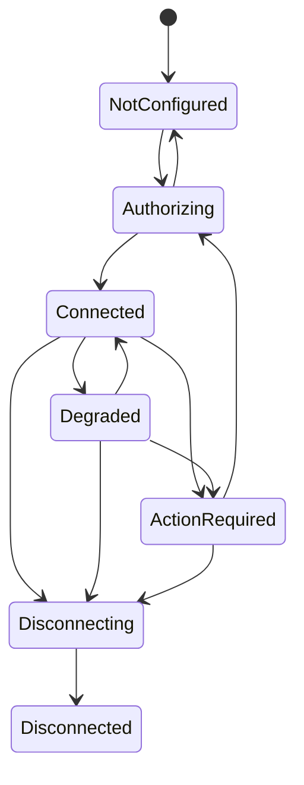

# Provider connections and authorization

- Status: Draft
- Date: 2026-09-20
- Catalog capability ID: `provider-connections-and-authorization`
- Owners: Symphonia maintainers
- Scope: disclose provider risk, authorize one external account, protect and refresh its grant, probe effective capabilities, reauthorize, and disconnect safely.
- Related requirements: `SYM-ACC-002`–`SYM-ACC-004`, `SYM-ACC-006`, `SYM-PROV-002`–`SYM-PROV-003`, `SYM-PROV-008`–`SYM-PROV-009`, `SYM-PROV-015`–`SYM-PROV-020`, `SYM-SEC-001`–`SYM-SEC-010`
- Related decisions/research: [provider specification](../docs/providers/provider-specification.md), [official API research](../docs/providers/provider-research.md), [ecosystem review](../docs/providers/home-assistant-ecosystem-review.md), [ADR 0004](../docs/decisions/0004-home-assistant-native-ui.md), [UI foundation](home-assistant-native-ui.md), `OQ-001`, `OQ-004`, `RG-001`, `RG-002`
- Required review gates: product UX, architecture, provider feasibility, testing, documentation, security/privacy
- Open decisions blocking readiness: direct App callback reachability and provider-specific registration/scopes/token lifecycle; unofficial YouTube Music MVP decision; secret key source and backup contract

## 1. Executive summary

Before any external account is connected, Symphonia explains whether the adapter uses an official or reverse-engineered contract, what credentials and dependencies it needs, what access it requests, and how reauthorization works. A successful connection identifies one immutable provider account, stores only encrypted grant material behind a secret reference, probes effective capabilities, and schedules import separately.

Following the accepted App-plus-Ingress deployment direction, the MVP uses a
direct App-owned, callback-only authorization flow. A future companion
integration may provide a native authorization broker, but it is not required
for the MVP and cannot be assumed by provider workflows. Neither boundary may
expose provider tokens to App options, URLs, logs, diagnostics, or ordinary UI
state.

```text
Choose adapter -> review access basis/scopes/limitations -> configure client credentials
-> authorize with single-use state -> verify immutable account -> store secret reference
-> probe effective capabilities -> connected/action-required -> disconnect and cleanup
```

## 2. Problem, current behavior, and evidence

### 2.1 Problem

Provider authentication differs in client registration, redirect rules, scopes, refresh, revocation, subscriptions, unofficial cookies, and object-level permissions. Hiding those differences creates unsafe secrets, surprising reauthorization, and workflows that fail only after partial writes.

### 2.2 Current behavior

The foundation now persists provider-neutral authorization attempts with hashed
and bounded state, exact redirect binding, expiry, single-use consumption,
bounded durable outcome codes, and callback state lookup that survives restart.
Invalid attempt metadata is rejected before SQLite writes. Provider token
exchange, secret storage, account verification, and the provider-specific
callback adapters do not yet exist. Spotify is the strongest official MVP
candidate; full YouTube Music access is not established through an official
API; Apple Music is future research.

### 2.3 Evidence and unknowns

- Official provider/API facts: [provider research](../docs/providers/provider-research.md).
- Home Assistant OAuth/Application Credentials and existing music projects: [ecosystem review](../docs/providers/home-assistant-ecosystem-review.md).
- Provider-independent contract: [provider specification](../docs/providers/provider-specification.md).
- Unknowns: callback reachability, secret encryption key, Google/YouTube product scope, exact scopes, token expiry/revocation behavior under test accounts, and provider-specific client-registration policy.

## 3. Actors, surfaces, and terminology

| Actor | Goal | Entry point | Visible surfaces |
| --- | --- | --- | --- |
| Home Assistant administrator | Configure provider client credentials and approve account access | Ingress connection setup | Provider disclosure, credential form, authorization return, connection status |
| Provider account holder | Grant/revoke the requested provider access | Provider consent UI | Provider-hosted consent and account selection |
| Symphonia worker | Use a valid grant within declared capabilities | Secret/provider ports | Refresh, probe, import/write calls |
| Companion integration, if selected | Broker HA-native authorization only | HA config flow/local API | HA integration setup and broker status |

**Adapter manifest** describes access basis, maturity, support, dependencies, and capability ceiling. **Connection attempt** is a short-lived authorization transaction. **Provider connection** is one verified immutable external account plus capability/health state and a credential reference. **Effective capability** is the intersection of adapter, connection, object, and live health constraints.

## 4. Goals, non-goals, and fixed invariants

### 4.1 Goals

1. Make authorization prerequisites, risk, permissions, and reauthorization understandable before consent.
2. Support safe connection, refresh/reauthorize, capability probing, and disconnect.
3. Isolate provider-specific flows behind semantic ports without provider DTO leakage.
4. Keep connection health/action states durable and usable after restart.

### 4.2 Non-goals

1. Importing libraries or executing playlist writes.
2. Selecting a shared hosted OAuth application for every future deployment.
3. Treating browser-cookie export as an ordinary OAuth equivalent.
4. Sharing one provider grant across different Symphonia installations without an explicit provider contract.

### 4.3 Fixed invariants

1. Provider type alone is never account identity.
2. Unknown/degraded capability is never treated as supported.
3. Authorization callbacks bind attempt, provider, initiating administrator/session, exact redirect, nonce/state, and expiry, and are single-use.
4. Secret plaintext never crosses presentation/log/diagnostic/ordinary backup boundaries.
5. An unofficial adapter is distinct, opt-in, visibly labeled, and independently disableable.
6. Disconnect stops admissions immediately and cannot erase user-authored identity decisions merely because provider payloads are removed.

## 5. Product journey

| Stage | Proposed behavior | User/operator effect |
| --- | --- | --- |
| Choose | Show available adapters and support/access classifications | User does not confuse community feasibility with official support |
| Review | Show capabilities, scopes, subscription/client-registration needs, dependencies, token lifetime, and known limits | Informed choice before secrets or consent |
| Configure | Validate non-secret and secret registration inputs through their correct storage boundary | Invalid callbacks/credentials fail before leaving the App |
| Authorize | Start one short-lived signed attempt and leave for provider consent | Return is bound to the initiating flow |
| Verify | Exchange/receive grant, fetch immutable account identity, persist secret reference, probe capabilities | Connection is not declared ready from a token alone |
| Operate | Refresh single-flight; show health/expiry/action required | Background work pauses safely when authorization fails |
| Disconnect | Revoke when supported, delete local grants, disable jobs, apply retention cleanup | User sees retained decisions/history versus removed provider data |



Text equivalent: an unconfigured adapter starts one authorization attempt; verification produces a connected state, which can degrade or require user action; reauthorization returns through a new attempt; disconnect revokes/erases safely and ends disconnected.

## 6. Functional behavior and state model

### 6.1 Happy path

1. The administrator selects an adapter and reads its manifest disclosure.
2. Symphonia validates required client registration and callback prerequisites.
3. A short-lived attempt is created with exact requested scopes and signed/single-use correlation state.
4. Provider consent returns through the accepted callback boundary.
5. The authorization owner exchanges/validates the result, retrieves immutable account identity, stores encrypted grant material, and passes only a secret reference inward.
6. The adapter probes effective capabilities and Symphonia shows `connected` plus any limitations.
7. The import capability schedules a separate durable operation.

### 6.2 Alternative and boundary paths

- Consent denial returns to `not_configured` with no connection or stored user grant.
- Missing optional scopes create a connected but reduced capability set only when the user explicitly accepted that mode.
- Expired/revoked credentials become `action_required`; pending writes are not blindly retried.
- Provider outage can be `degraded` without claiming reauthorization is required.
- Multiple accounts of one provider retain separate connection IDs, secret references, account identity, capability probes, and rate budgets.
- An unofficial cookie-based adapter, if ever accepted, uses a different configuration/credential contract and cannot call itself OAuth.

### 6.3 State machine

| State | Entered when | User-visible meaning | Allowed next states | Recovery/owner |
| --- | --- | --- | --- | --- |
| `not_configured` | no verified connection | Provider is not connected | `authorizing` | administrator |
| `authorizing` | live unexpired attempt exists | Waiting for consent/return | `connected`, `not_configured` | user completes or cancels |
| `connected` | grant, identity, and capability probe are valid | Eligible capabilities may be used | `degraded`, `action_required`, `disconnecting` | automatic refresh/probe |
| `degraded` | transient provider/dependency/partial capability fault | Some named features unavailable | `connected`, `action_required`, `disconnecting` | retry or administrator |
| `action_required` | expired/revoked/invalid grant or changed required terms | Jobs needing provider access are paused | `authorizing`, `disconnecting` | administrator reauthorizes |
| `disconnecting` | cleanup is underway | No new provider work is admitted | `disconnected` | automatic/bounded user action |
| `disconnected` | local grant erased and cleanup scheduled | No provider access remains | terminal or new independent setup | administrator |

Authorization attempts also have `created`, `redirected`, `returned`, `consumed`, `denied`, `expired`, and `failed` states; only one transition may consume the callback.

## 7. Configuration contract

Exact provider field names remain adapter-owned. Every field declares type, secret status, validation, persistence, and documentation URL.

| Input | Type | Recommended default | Allowed values/range | Scope/persistence |
| --- | --- | --- | --- | --- |
| OAuth application ownership | enum | bring-your-own for distributed self-hosting | accepted shared registration or per-install credentials | adapter/install; snapshotted for attempt |
| Requested capability profile | enum | minimum MVP import/copy profile | adapter-declared bounded profiles | connection; exact scopes snapshotted |
| Callback mode | enum | direct App callback-only, pending `RG-002` | one accepted direct callback profile | install; restart required if the callback profile changes |
| Unofficial access acknowledgement | boolean | `false` | explicit `true` only for accepted unofficial adapter | connection plus policy version/time |

Client secrets, refresh tokens, Music User Tokens, browser cookies, and authorization codes are never App options. Redirect targets, scope sets, provider hosts, and token endpoints come from versioned adapter definitions, not arbitrary user URLs unless an accepted provider explicitly requires a bounded configurable endpoint.

## 8. Clean Architecture design

### 8.1 Responsibilities and dependency direction

| Boundary | Owns | Must not own/import |
| --- | --- | --- |
| Domain | Connection identity, health/action state, capability descriptors | OAuth libraries, HTTP, HA config flow |
| Application | begin/complete/reauthorize/disconnect/probe use cases | Provider SDK DTOs, token persistence implementation |
| Provider adapter | Provider authorization metadata, account lookup, refresh/revoke, capability probe | Cross-provider workflow policy |
| Secret adapter | encrypt/store/load/delete/rotate by opaque reference | UI or provider semantics |
| Future HA broker adapter | Config flow/Application Credentials and one-use local handoff | MVP provider imports/writes, database access |
| Presentation | Disclosure/forms/status/error mapping | Token values or authorization decisions |

### 8.2 Contracts, durable state, and trust boundaries

- Pure decisions: manifest disclosure, scope/capability comparison, state transitions, retry versus action-required classification.
- Use cases: list adapters, begin attempt, complete attempt, probe, refresh, reauthorize, disconnect.
- Ports: provider authorization, secret store, attempt repository, connection repository, clock/ID, cleanup scheduler, audit.
- Durable state: manifest/version acknowledgement, attempt metadata without reusable secrets, connection/account identity, secret reference, capability evidence, expiry/health.
- Concurrency: one callback consumption per attempt; one refresh single-flight per connection; disconnect fences new work.
- Untrusted inputs: provider callbacks/errors, user client credentials, cookie/header material, redirect/query parameters, companion-integration messages.

### 8.3 Authorization boundary alternatives

| Alternative | Benefits | Costs/risks | Readiness evidence |
| --- | --- | --- | --- |
| Direct App-owned OAuth | Self-contained provider adapter and standalone parity | Public callback/exposure, exact redirect, token storage all owned by App | `RG-002` callback-only listener and remote/local tests |
| Companion-integration broker (future) | Reuses HA Application Credentials/config-flow callback UX | Second artifact, token ownership/handoff, backup/version skew | Separate native-surface RFC; not an MVP dependency |

The direct App callback is the MVP working direction. `RG-002` must still
prove its local/remote reachability, listener isolation, and secret/recovery
properties before the SDD can become ready for implementation.

### 8.4 Executable architecture constraints

- Static tests reject provider/HA/secret implementation imports from domain/application policy.
- Adapter contract tests require manifest completeness, typed error mapping, scope/capability probes, and secret-safe failures.
- Route tests prove callbacks cannot reach management handlers or redirect outside an allowlist.
- Canary tests search logs, errors, DB non-secret columns, API/UI, metrics, traces, diagnostics, and backups for credential values.

## 9. UI/UX and content contract

Connection, disclosure, credential, callback-result, status, and disconnect views conform to the [Home Assistant-native UI foundation](home-assistant-native-ui.md). They use the shared settings/list rows, cards/sections, fields/choices, buttons, status chips, adjacent alerts, adaptive confirmation dialogs, and loading/empty states. Provider branding identifies the provider but does not replace Home Assistant interaction hierarchy. Risk, unofficial access, permission scope, and reconnection remain textual and cannot be reduced to a colored badge.

### 9.1 Information hierarchy

Before the primary `Connect` action, show access basis, maturity/support, account/subscription prerequisites, requested functional access, credential type, callback/remote-access needs, external dependencies, reauthorization expectation, and known limitations.

### 9.2 Representative states

```text
Spotify · official API · beta adapter
Can read saved tracks and playlists and create playlists after capability verification.
Requires: Spotify Premium and your own Developer application.
Authorization: OAuth; reauthorization may be required when the provider grant expires.
Primary action: Connect Spotify
```

```text
YouTube Music · unofficial reverse-engineered access · experimental/best effort
This adapter would require reusable browser-account credentials and may stop working when Google changes private behavior.
No write capability is promised. Use is not enabled in this build.
```

```text
Spotify needs reconnection
Impact: imports and playlist writes are paused; existing library/history remain available.
Cause: the provider rejected the expired grant.
Action: Reconnect Spotify.
Retained state: mappings, plans, and audit history are unchanged.
```

```text
Disconnected from Spotify
Provider access and local credential material were removed. Provider-derived cached data is scheduled for policy cleanup; manual decisions and operation summaries remain.
```

### 9.3 Accessibility and localization

Risk/support is textual, not icon-only. Consent-return errors receive focus and a live-region announcement without exposing query values. External provider links identify their destination. Provider/user display names are escaped and truncated. English fallback exists for any missing provider translation.

## 10. Failure, recovery, and cleanup

| Failure/partial state | User impact | Retained facts | Automatic retry | Required action | Cleanup |
| --- | --- | --- | --- | --- | --- |
| Consent denied/expired attempt | no connection | audit reason only | no | restart flow | erase transient material |
| Callback replay/state mismatch | no connection | security event/correlation | no | restart flow if legitimate | invalidate attempt |
| Token exchange outcome unknown | no usable connection | attempt marked uncertain | read/reconcile only if provider supports | retry authorization otherwise | no duplicate connection |
| Account identity fetch fails | not connected | secret held only within bounded transaction/recovery | bounded transient retry | retry later | delete grant if setup aborts |
| Refresh race | affected jobs wait | current credential reference/version | single-flight owner only | none/action if rejected | losers reread result |
| Provider outage | degraded | connection/capabilities/history | bounded backoff | none unless prolonged | no credential deletion |
| Grant revoked/expired | jobs paused | connection and non-secret history | no blind retry | reauthorize | old grant replaced/erased |
| Disconnect revoke fails | external grant may remain | local disconnect audit | bounded safe retry | revoke in provider UI | local credentials still erased per policy |

## 11. Security, permissions, and privacy

1. Use current recommended authorization-code/PKCE behavior for the deployment/client type; never invent a password-collection flow.
2. Callback state is signed/opaque, short-lived, single-use, and bound to initiator, provider, redirect, and attempt.
3. Secret material is encrypted at rest, versioned for rotation, absent from general database exports, and redacted through canary tests.
4. Provider/adapter URLs and schemes are allowlisted; user/provider data cannot choose filesystem paths, modules, callbacks, or unrestricted egress.
5. A companion broker uses mutual/local authentication and a one-use handoff; it never exposes HA-stored credentials through ordinary service/entity state.
6. Browser-cookie access, if accepted, requires a dedicated threat model, explicit primary-account warning, deletion/revocation steps, and independent release kill switch.

## 12. Observability and operational UX

- Connection view shows health, capability evidence age, grant/reauthorization horizon when known, last probe/import, and action required.
- Audit records authorization start/result category, account identity hash/reference, capability changes, refresh/reauth/disconnect, and actor—never token/header/body.
- Metrics count attempts/results, refresh outcomes, action-required age, capability changes, and sanitized provider error categories.
- Provider outage is distinct from invalid credentials; a 5xx must not tell users to reconnect.
- Stable connected state emits no periodic notifications; only impending required action, revocation, capability loss, or repeated failure is prominent.

## 13. Compatibility, migration, rollout, and rollback

- Adapter manifest/version and acknowledgement version are stored with a connection.
- Scope/capability changes require explicit reauthorization when grants cannot safely expand in place.
- Secret schema/key rotation is transactional and recoverable; rollback never writes old plaintext formats.
- Direct and broker modes do not coexist indefinitely for one connection; migration requires an explicit reauthorization or proven one-time handoff.
- Removing/rolling back an adapter disables its jobs while preserving audit and user decisions.

## 14. Testing strategy and numeric budget

Minimum **82 distinct cases**:

| Area | Minimum distinct cases | Behaviors/risks covered |
| --- | ---: | --- |
| Manifest/configuration/capability policy | 16 | classifications, scopes, account/object/live intersections, invalid combinations |
| Attempt/state/idempotency/races | 20 | expiry, denial, replay, duplicate callback, refresh/disconnect races, restart |
| Provider/secret/callback adapters | 18 | exchange/refresh/revoke/probe, error mapping, rotation, listener isolation, timeouts |
| HTTP/UI/accessibility/sanitization | 12 | disclosures and all states, focus, hostile names/errors/URLs, locale fallback |
| Integration/security/migration | 16 | direct/broker paths, listener isolation, canary leakage, backup, reauth migration |
| **Total** | **82** | No double counting |

Provider contract tests are offline and deterministic. Live smoke tests are opt-in, use dedicated accounts/client registrations, bounded scopes/quota, and safe cleanup. Exact secrets are seeded as canaries and asserted absent from every non-secret boundary. Manual evidence reviews provider consent transitions and narrow/mobile disclosures.

The twelve feature-specific UI cases supplement the UI-foundation budget and inherit its catalog, host-context, theme, accessibility, responsive, hostile-content, and dated visual-reference release gates.

## 15. Documentation and discoverability

| Audience | Artifact | Required content | Validation/navigation |
| --- | --- | --- | --- |
| User | Connect/reconnect/disconnect guide | support labels, scopes, normal flow, retained data | UI content fixtures |
| Setup owner | Per-provider setup | developer registration, callback, secrets, subscription/dependencies | live-spike matrix |
| Operator | Authentication troubleshooting | outage vs revoked, expiry, rotation, revoke/cleanup | error decision tree |
| Contributor | Adapter/auth architecture | ports, secret boundary, direct/broker contract | architecture/contract tests |

## 16. Acceptance scenarios

1. Given an official adapter, setup shows access basis, maturity/support, prerequisites, scopes, callback mode, and reauthorization expectations before `Connect`.
2. Given a valid consent return, exactly one attempt is consumed, immutable account identity is verified, only a secret reference enters connection state, and effective capabilities are shown.
3. Given denial, expired state, replay, wrong initiator, wrong provider, or wrong redirect, no connection is created and transient secrets are removed.
4. Given two simultaneous refresh requests, one exchange occurs and all callers observe one durable result.
5. Given provider outage, the connection becomes degraded without falsely requesting reauthorization; given invalid grant, it becomes action-required without blind retries.
6. Given a read-only playlist or missing scope, planning sees the object/connection denial even when the adapter supports the operation generally.
7. Given disconnect, new calls stop, local grant material is erased, revocation is attempted safely, provider-data cleanup is scheduled, and manual decisions/audit remain.
8. Given an unofficial adapter, authorization cannot begin without explicit risk acknowledgement and the UI never labels it official/supported by Home Assistant.
9. Given hostile callback/provider/error content, no open redirect, path/egress injection, Markdown/HTML injection, or secret output occurs.
10. Given App restart at every attempt phase, no callback is consumed twice and no orphan grant becomes an active connection.
11. Given a direct callback listener, management routes and Ingress identity headers are unavailable on that listener, and a forged/replayed callback cannot create a connection.
12. Given official, unofficial, connected, degraded, action-required, authorizing, and disconnected fixtures, the shared Home Assistant-native component families preserve information hierarchy, keyboard/focus behavior, narrow layout, theme parity, and textual risk without exposing secret material.

## 17. Requirements traceability

| Requirement | Owner | Test or evidence | Documentation |
| --- | --- | --- | --- |
| `SYM-ACC-002`–`SYM-ACC-004`, `SYM-ACC-006` | connection use cases/presentation | lifecycle + disclosure fixtures | user connection guide |
| `SYM-PROV-002`, `SYM-PROV-003`, `SYM-PROV-019` | capability policy/adapter | connection/object/live matrix | provider capability reference |
| `SYM-PROV-015`–`SYM-PROV-020` | manifest and presentation | schema/opt-in/label tests | provider support policy |
| `SYM-SEC-001`–`SYM-SEC-007` | auth/secret ports | replay/race/canary/rotation tests | security and provider setup |
| `SYM-SEC-008`–`SYM-SEC-010` | listener/callback/provider adapters | route/redirect/path/egress abuse tests | callback operations guide |
| `SYM-TEST-005`, `SYM-TEST-011`, `SYM-TEST-012` | verification tooling | release gates | contributor testing guide |

## 18. Implementation sequence

1. Complete `RG-001`/`RG-002`, secret/backup threat model, and authorization-boundary ADR.
2. Define manifest, attempt, connection, capability, and normalized-error contracts plus architecture tests.
3. Implement pure state/capability/disclosure policies and deterministic tests.
4. Implement application use cases and fake provider/secret/callback ports.
5. Implement one official provider adapter and the direct callback boundary behind contract tests.
6. Add UI, reauthorization/disconnect, diagnostics, documentation, and opt-in live smoke evidence.

## 19. Definition of Done

- [ ] Authorization-boundary, provider-scope, unofficial-access, and secret/backup blockers are resolved.
- [ ] Every requirement and state maps to acceptance and deterministic verification.
- [ ] At least 82 distinct cases and secret-canary gates pass.
- [ ] Callback replay, redirect, listener isolation, refresh race, rotation, and disconnect are proven.
- [ ] Provider DTOs and secret implementations do not cross inward architecture boundaries.
- [ ] Disclosures and action-required/degraded/disconnected states pass accessibility and sanitization review.
- [ ] Per-provider setup, recovery, revocation, and risk documentation is complete.
- [ ] Live evidence is bounded/opt-in and catalog implementation evidence is current.
- [ ] Explicit owner approval to implement exists.

## 20. References and decisions

- Primary sources: official provider and Home Assistant sources in [provider research](../docs/providers/provider-research.md).
- Related SDDs: [App runtime](home-assistant-app-runtime-and-ingress.md), [imports](library-import-and-provider-projections.md), [durable operations](durable-operations-and-recovery.md).
- Related UI contract: [Home Assistant-native UI foundation](home-assistant-native-ui.md) and [ADR 0004](../docs/decisions/0004-home-assistant-native-ui.md).
- Accepted: capability and risk disclosure before authorization; opaque secret references; distinct unofficial adapters.
- MVP direction: direct App-owned callback-only OAuth; a companion broker is deferred.
- Rejected: tokens in App options; pasted callback URLs as tokens; generic retry of invalid grants; treating private APIs as official.
