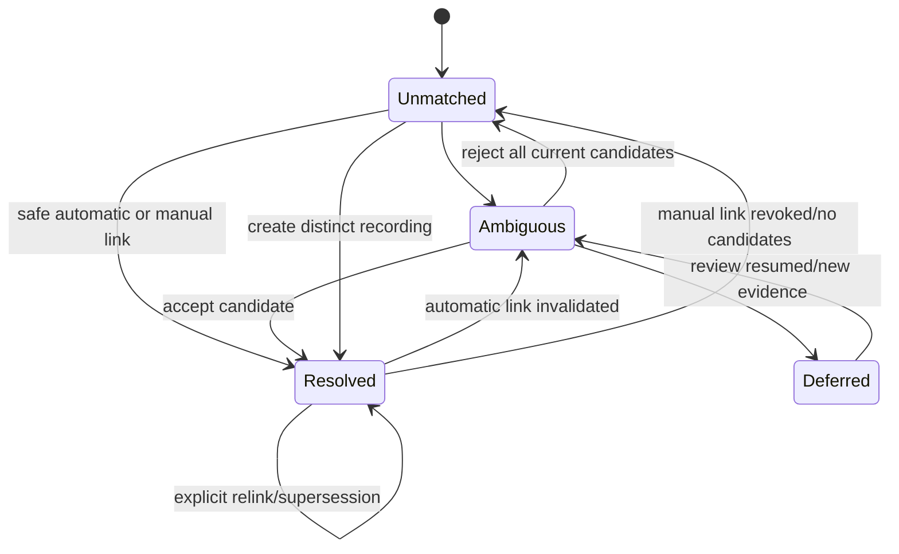

# Recording identity resolution

- Status: Draft
- Date: 2026-09-20
- Catalog capability ID: `recording-identity-resolution`
- Owners: Symphonia maintainers
- Scope: resolve provider track representations to provider-independent recordings using explainable, versioned evidence and durable manual decisions.
- Related requirements: `SYM-PROD-002`–`SYM-PROD-003`, `SYM-LIB-002`, `SYM-MATCH-001`–`SYM-MATCH-008`, `SYM-ARCH-014`, `SYM-TEST-007`–`SYM-TEST-008`
- Related decisions/research: [ADR 0001](../docs/decisions/0001-provider-independent-recording-domain.md), [identity domain model](../docs/domain/domain-model.md#identity-resolution-specification), [provider research](../docs/providers/provider-research.md), `RG-003`
- Required review gates: product UX, domain/music semantics, architecture, provider feasibility, testing/data licensing, documentation
- Open decisions blocking readiness: reviewed labeled corpus; automatic-link precision/false-link tolerance; versioned scoring/confidence policy; provider candidate retrieval/quota evidence

## 1. Executive summary

Symphonia resolves provider representations to recordings conservatively. Exact identifiers such as ISRC are strong evidence but never sole proof; title similarity alone is never sufficient. Automatic decisions are versioned and explainable, ambiguous items enter a review queue, and manual acceptance/rejection is durable and cannot be overwritten silently.

The recommended MVP default is precision-first: automatically link only policy-approved high-confidence evidence, prefer `ambiguous`/`unmatched` over a wrong recording, and require explicit review before a copy depends on uncertain identity.

```text
Provider track -> normalize without destroying originals -> generate bounded candidates
-> evaluate identifiers/version/artist/duration/release evidence -> classify
-> safe auto-link OR review queue -> durable accept/reject/distinct/defer decision
-> future imports and plans reuse or explicitly invalidate that decision
```

## 2. Problem, current behavior, and evidence

### 2.1 Problem

Catalogs contain missing/wrong IDs, localized metadata, covers, live/studio variants, remasters, edits, clean/explicit releases, music videos, user uploads, compilations, and duration differences. A false link silently copies the wrong recording and contaminates future operations; an unmatched item is visible and recoverable.

### 2.2 Current behavior

No resolver exists. The provider-independent recording decision is accepted, but candidate algorithms, thresholds, corpus, and precision targets remain open.

### 2.3 Evidence and unknowns

- Domain invariants and required pipeline: [domain model](../docs/domain/domain-model.md#identity-resolution-specification).
- Official metadata availability: [provider research](../docs/providers/provider-research.md).
- Comparative evidence: Music Assistant uses provider mappings and automatic search/matching, but Symphonia requires stronger evidence/audit; [ecosystem review](../docs/providers/home-assistant-ecosystem-review.md#provider-mappings-validate-the-representation-graph).
- Unknowns: candidate recall by provider, labeled corpus licensing, acceptable false-positive rate, confidence boundaries, manual-review scale.

## 3. Actors, surfaces, and terminology

| Actor | Goal | Entry point | Visible surfaces |
| --- | --- | --- | --- |
| Symphonia user/reviewer | Confirm or reject ambiguous identities | Resolution queue or copy-plan blocker | Candidate comparison, evidence, decision history |
| Resolver | Produce reproducible assessments | New/changed provider projection | Candidate set, evidence, confidence class, version |
| Provider adapter | Retrieve bounded candidates/metadata | Candidate search/get ports | Normalized candidates and capability/quality warnings |
| Copy planner | Use only policy-approved active links | Plan creation | Ready/non-ready entry classification |

**Recording** is one specific recorded performance/version. **Provider track** is an external representation. **Candidate assessment** is a versioned comparison, not a link. **Identity link** is the active relation between a provider track and recording. **Rejected pair** is durable negative evidence. **Distinct recording** means the reviewer asserts that the provider track should not be merged with current candidates.

## 4. Goals, non-goals, and fixed invariants

### 4.1 Goals

1. Produce safe, explainable, reproducible identity decisions.
2. Preserve meaningful version distinctions and provider evidence provenance.
3. Make ambiguity review efficient without hiding uncertainty.
4. Reuse manual positive and negative decisions across operations.
5. Measure candidate recall and link precision separately.

### 4.2 Non-goals

1. Identifying an abstract musical work or merging cover performances.
2. Recommending music or learning from private libraries with an ML model.
3. Guaranteeing every provider item can be resolved.
4. Treating popularity, title equality, or one provider's canonical claim as universal truth.
5. Mutating provider data.

### 4.3 Fixed invariants

1. A provider track has zero or one active recording link; a recording may have many provider tracks.
2. ISRC is evidence, not infallible proof; normalized title alone cannot auto-link.
3. Originals and derived comparison values retain provenance.
4. Manual accept/reject/distinct decisions outrank automation until explicitly revoked or invalidated with reason.
5. Every automatic assessment records resolver/rule/data versions and material positive/negative evidence.
6. Covers, live/studio, remix/edit, acoustic, remaster, clean/explicit, and video/upload distinctions are not collapsed when evidence indicates a difference.

## 5. Product journey

| Stage | Proposed behavior | User/operator effect |
| --- | --- | --- |
| Normalize | Derive comparison fields while retaining originals and provenance | User can inspect what changed for comparison |
| Generate | Retrieve bounded candidates from identifiers, existing graph, and provider search | Quota/candidate source and completeness are visible |
| Evaluate | Compare identifiers, credits, title/version tokens, duration, release, explicitness, media type, market | Each confidence class has human-readable evidence |
| Apply policy | Auto-link only accepted classes; route ambiguity/unmatched separately | Wrong-link risk is explicit and conservative |
| Review | Accept candidate, reject pair, create distinct recording, defer, or revoke | Decision is attributable and immediately reusable |
| Re-evaluate | New metadata/rule versions can reassess without silently replacing manual truth | Invalidations and supersession are visible |



Text equivalent: items begin unmatched; candidate evidence may make them ambiguous or safely resolved; reviewers may resolve, reject, create a distinct recording, or defer; later evidence may invalidate automatic links, while manual links change only through explicit revocation/supersession.

## 6. Functional behavior and state model

### 6.1 Happy path

1. A changed provider track is queued with its immutable observed metadata reference.
2. Normalization produces versioned comparison fields without altering the source projection.
3. Candidate generation checks durable accepted/rejected mappings, exact external identifiers, existing recording representations, and bounded provider search where permitted.
4. Evaluation emits candidate evidence and confidence; policy either creates an automatic link or stores a review/unmatched result.
5. A reviewer sees original metadata, material differences, provider availability, and prior decisions.
6. The accepted decision writes an attributable link/rejection/distinct recording and invalidates affected copy plans rather than mutating them.

### 6.2 Alternative and boundary paths

- Missing ISRC can still yield candidates; shared ISRC with conflicting version evidence cannot auto-link by identifier alone.
- A YouTube music/lyric/live/user-upload video receives media-type/version evidence and usually weaker confidence than a label catalog track.
- A rejected pair is excluded from future automatic linking but may be shown as previously rejected if materially new evidence appears.
- Provider metadata change triggers versioned reassessment; it does not silently edit historical evidence.
- If candidate search is rate-limited/unavailable, the state remains unmatched/deferred with an incomplete-search reason.
- Deleting a provider connection removes/retains provider payloads per policy while preserving manual decision history as allowed.

### 6.3 Resolution states

| State | Entered when | User-visible meaning | Allowed next states | Recovery/owner |
| --- | --- | --- | --- | --- |
| `unmatched` | no policy-acceptable candidate/link | No recording selected | `ambiguous`, `resolved`, `deferred`, `invalid` | new evidence or reviewer |
| `ambiguous` | multiple/insufficient candidates require judgment | Copy is blocked or explicit best effort required | `resolved`, `unmatched`, `deferred`, `invalid` | reviewer |
| `resolved` | one active automatic/manual link exists | Recording identity is available with origin/evidence | `ambiguous`, `unmatched`, `invalid`, `resolved` via explicit supersession | invalidation/reviewer |
| `deferred` | reviewer intentionally postponed | No automatic relink until trigger/policy permits | `ambiguous`, `resolved`, `unmatched`, `invalid` | reviewer/new evidence |
| `invalid` | source representation cannot participate under current model | Item remains auditable but unusable for recording copy | `unmatched` after corrected evidence | provider fix/re-import |

Candidate assessments separately use `exact`, `high_confidence`, `ambiguous`, and `unmatched`; these do not replace the provider track's resolution state.

## 7. Configuration contract

Threshold values are not general user settings in the MVP. They are versioned resolver policy accepted with corpus evidence.

| Input | Type | Recommended default | Allowed values/range | Scope/persistence |
| --- | --- | --- | --- | --- |
| Automatic-link policy | versioned policy ID | precision-first accepted release policy | reviewed built-in policies only | snapshotted in assessment/link |
| Candidate limit | bounded integer per source | conservative corpus/provider-derived default | adapter/policy hard range | snapshotted per run |
| Search sources | set | existing graph + official provider sources allowed by policy | adapter-declared sources | policy/version |
| Deferred recheck | enum | new material metadata or explicit user action | bounded triggers | decision metadata |

Users cannot lower safety thresholds ad hoc, enable title-only auto-linking, discard negative decisions, or turn provider-specific identifiers into recording IDs.

## 8. Clean Architecture design

### 8.1 Responsibilities and dependency direction

| Boundary | Owns | Must not own/import |
| --- | --- | --- |
| Domain | Recording, provider track identity, link/rejection invariants, evidence/confidence types | Provider SDK/search/database/UI |
| Application | Resolve/review/revoke/invalidate use cases and plan invalidation | Concrete scoring/search implementation dependencies |
| Resolver policy | Pure normalization/evaluation/classification from normalized evidence | Network, persistence, clock |
| Candidate adapters | Provider/external lookup and metadata normalization | Link acceptance policy |
| Persistence | Evidence/link/rejection/version history | Silent conflict resolution |
| Presentation | Comparison/review/history view models | Mutating links outside use cases |

### 8.2 Contracts, durable state, and trust boundaries

- Pure decisions: normalization, evidence comparison, confidence classification, automatic-link eligibility, invalidation.
- Use cases: resolve provider track, review decision, reject pair, create distinct recording, defer, revoke/supersede, inspect history.
- Ports: provider candidate search/get, recording/link/evidence repositories, corpus/policy version, audit, durable operation scheduler.
- Durable state: source observation references, candidate assessments, evidence, active/superseded/revoked links, rejected pairs, actor/time/resolver version.
- Concurrency: decision version/optimistic fence prevents a stale resolver from overwriting a newer manual action.
- Untrusted inputs: all provider metadata, identifiers, artwork/URLs, user-entered notes, external metadata.

### 8.3 Executable architecture constraints

- Pure resolver modules cannot import provider SDK, HTTP, database, filesystem, clock, or UI modules.
- Corpus tests report precision/recall and regression by case category and resolver version.
- State tests prove manual decisions win every race with automatic reassessment.
- Presentation tests prove explanations derive from stored structured evidence, not opaque score text.

## 9. UI/UX and content contract

### 9.1 Information hierarchy

The review queue shows source identity/state first, then the best candidates and decisive evidence/differences, followed by one primary action. It never leads with an unexplained numeric score.

### 9.2 Representative states

```text
Needs review · “Hallelujah” — Jeff Buckley
Why: two catalog candidates share title and artist. The durations differ by 41 seconds and one is marked live.

Recommended candidate
Hallelujah · Grace · 6:53 · studio · ISRC USSM19400391
Evidence: artist exact; title exact; album exact; duration +1s; source has no ISRC.

Other candidate
Hallelujah (Live at Sin-é) · 9:16 · live
Difference: version marker and duration conflict.

Primary action: Accept recommended candidate
Other actions: Reject candidate · Create distinct recording · Defer
```

```text
Resolved manually
Linked to the studio recording by the Home Assistant administrator on 20 Sep 2026.
This decision will be reused. Revoke or choose a different recording to change it.
```

```text
Automatic link invalidated
New provider metadata marks this item as a live version. No replacement was selected.
Impact: new copy plans will treat the item as ambiguous; completed copies/history are unchanged.
Action: Review candidates.
```

### 9.3 Accessibility and localization

Candidate comparison works by keyboard with explicit selected row/action and focus return. Evidence differences use text, not red/green alone. Screen readers receive candidate headings and concise difference summaries. Original provider text and normalized text remain distinguishable. User/provider content is escaped and length-bounded; localized metadata is not forcibly translated.

## 10. Failure, recovery, and cleanup

| Failure/partial state | User impact | Retained facts | Automatic retry | Required action | Cleanup |
| --- | --- | --- | --- | --- | --- |
| Candidate search rate-limited | item remains unresolved | source/evidence/search checkpoint | bounded schedule | none unless exhausted | cached results honor retention |
| Provider search unavailable | no fresh candidates | prior assessments labeled stale | bounded | retry/review existing evidence | no link inferred |
| Resolver crash/restart | delayed assessment | operation/source version | durable retry | none | idempotent assessment key |
| Stale automatic result races manual decision | none to manual truth | both attempts/audit | automatic result rejected | none | no silent overwrite |
| Metadata invalidates automatic link | future plans blocked/ambiguous | old link/evidence/status history | reassess once | review if ambiguous | old link superseded, not erased |
| Manual decision becomes impossible | action required | manual history and reason | no automatic replacement | revoke/relink | provider payload retention applies |

## 11. Security, permissions, and privacy

1. Only an authenticated authorized administrator may create/revoke manual decisions in the MVP.
2. Provider/user metadata is untrusted content and never controls markup, URLs, paths, queries beyond bounded adapter parameters, or code.
3. Evidence stores only fields justified for resolution/audit and carries provider retention/deletion classification.
4. Automatic decisions and manual actors are auditable; forged/stale commands fail optimistic version checks.
5. Resolver/corpus fixtures contain synthetic or legally redistributable data, never copied private libraries or restricted training datasets.

## 12. Observability and operational UX

- Metrics: counts by resolution state/origin/provider, candidate search outcomes, automatic-link rate, manual accept/reject/defer/revoke, invalidations, corpus regressions.
- Audit: provider track, recording/link IDs, actor, source observation, resolver/policy version, evidence categories, decision transition; no raw token/payload.
- Copy plans reference exact active link/evidence versions so later changes do not rewrite history.
- Search waiting/provider outage is distinct from genuine unmatched classification.
- Queue notifications are bounded summaries; individual ambiguous items do not create notification spam.

## 13. Compatibility, migration, rollout, and rollback

- Resolver and normalization versions are immutable identifiers; new versions create new assessments.
- Automatic links can be re-evaluated under controlled rollout; manual links/rejections are never bulk-replaced.
- Schema migrations preserve full decision/link status history and rejected pairs.
- Rollback continues to understand links it created or blocks with a compatibility message; it does not reinterpret scores.
- Initial rollout may operate manual-only until corpus thresholds justify automatic linking.

## 14. Testing strategy and numeric budget

Minimum **96 distinct cases** due to the high cost of false links:

| Area | Minimum distinct cases | Behaviors/risks covered |
| --- | ---: | --- |
| Normalization/evidence/classification | 34 | identifiers, Unicode, credits, duration, releases, every version distinction, missing/conflicting data |
| State/application/concurrency | 18 | accept/reject/distinct/defer/revoke, stale resolver, invalidation, replay, plan references |
| Candidate/provider contracts | 14 | bounded search, quota, availability, generic video vs catalog, malformed/duplicate candidates |
| UI/accessibility/sanitization | 12 | unmatched/ambiguous/resolved/invalidated, keyboard/focus, hostile metadata, locale/narrow views |
| Integration/security/migration | 18 | corpus regressions, manual preservation, schema/version changes, retention, permission/forgery |
| **Total** | **96** | No double counting |

The corpus includes exact duplicates, missing/wrong/reused ISRC, covers, live/studio, remasters, remixes/edits, acoustic, clean/explicit, compilations, featured artists, localized metadata, music/lyric videos, uploads, duration drift, and misleading titles. Candidate recall and accepted-link precision are reported separately. Numeric acceptance thresholds remain a blocker until corpus review.

## 15. Documentation and discoverability

| Audience | Artifact | Required content | Validation/navigation |
| --- | --- | --- | --- |
| User | Matching/review guide | recording meaning, evidence, actions, reuse/revoke | review UI fixtures |
| Setup owner | Provider matching limits | metadata/search quality, quota, privacy | provider matrix |
| Operator | Resolver troubleshooting | stuck search, invalidation, corpus/policy version | decision tree |
| Contributor | Resolver architecture/corpus guide | pure policy, evidence schema, licensing, regression rules | architecture/corpus gates |

## 16. Acceptance scenarios

1. Given matching high-quality identifiers and no material version conflict, the accepted policy may auto-link and records structured evidence plus resolver/policy version.
2. Given title equality alone, no automatic link is created.
3. Given a shared ISRC but conflicting live/studio, duration, or version evidence, the item becomes ambiguous rather than silently merged.
4. Given cover, remix, remaster, acoustic, clean/explicit, compilation, video, upload, and featured-artist corpus cases, expected distinctions and evidence explanations remain stable.
5. Given manual acceptance or rejection racing automatic reassessment, the manual version wins and the stale result is recorded/rejected without overwrite.
6. Given a rejected pair, future resolution excludes it unless materially new evidence is explicitly shown to the reviewer.
7. Given create-distinct, a provider-independent recording is created without asserting a musical-work relation or merging similar titles.
8. Given automatic-link invalidation, future plans see ambiguity/unmatched while completed plan/history references remain unchanged.
9. Given hostile metadata/URLs/user notes, comparison UI and logs remain escaped, bounded, and non-executable.
10. Given resolver-version rollout/rollback, manual decisions persist and corpus regressions block release under the accepted thresholds.

## 17. Requirements traceability

| Requirement | Owner | Test or evidence | Documentation |
| --- | --- | --- | --- |
| `SYM-MATCH-001`–`SYM-MATCH-002` | domain/state/use cases | state/link/evidence tests | matching guide |
| `SYM-MATCH-003`–`SYM-MATCH-004` | resolver policy | labeled corpus category suite | evidence explanation guide |
| `SYM-MATCH-005`–`SYM-MATCH-006` | review use cases/persistence | manual action/race/reuse tests | review/revoke guide |
| `SYM-MATCH-007`–`SYM-MATCH-008` | evidence/policy/presentation | explanation/version fixtures | contributor resolver guide |
| `SYM-ARCH-014` | candidate scheduler/cache | quota/cache/retention tests | provider limits |
| `SYM-TEST-007`–`SYM-TEST-008` | corpus/release tooling | category metrics/regression gate | corpus maintenance guide |

## 18. Implementation sequence

1. Build/license/review the corpus and accept error costs, confidence policy, and release thresholds.
2. Define evidence/link/rejection/state schemas and architecture boundaries.
3. Implement pure normalization/evaluation/policy with corpus tests in manual-only mode.
4. Implement application review/invalidation use cases and persistence with race/replay tests.
5. Add candidate adapters behind bounded contracts and quota/retention controls.
6. Add review UI, accessibility, explanations, docs, then controlled automatic-link rollout.

## 19. Definition of Done

- [ ] Corpus, precision/recall thresholds, confidence policy, and candidate feasibility blockers are accepted.
- [ ] Every requirement and state maps to acceptance and deterministic/corpus tests.
- [ ] At least 96 distinct cases pass with required category/regression reporting.
- [ ] Manual decisions win all races and survive migrations/resolver changes.
- [ ] False-link safety, evidence/version provenance, invalidation, and plan history are proven.
- [ ] Review UX passes keyboard, screen-reader, narrow layout, localization fallback, and sanitization review.
- [ ] Corpus licensing/privacy and provider data-retention rules are documented.
- [ ] Catalog evidence is current and explicit owner approval to implement exists.

## 20. References and decisions

- Primary sources: official provider metadata research in [provider research](../docs/providers/provider-research.md).
- Related SDDs: [imports](library-import-and-provider-projections.md), [playlist copy](one-time-playlist-copy.md), [durable operations](durable-operations-and-recovery.md).
- Accepted: recording identity is provider-independent; uncertainty/manual evidence are first-class.
- Rejected: title-only matching, opaque score-only UX, silent automatic override of manual decisions, work-level cover merging.
- Follow-up: musical-work relationships and additional metadata providers after MVP evidence.
